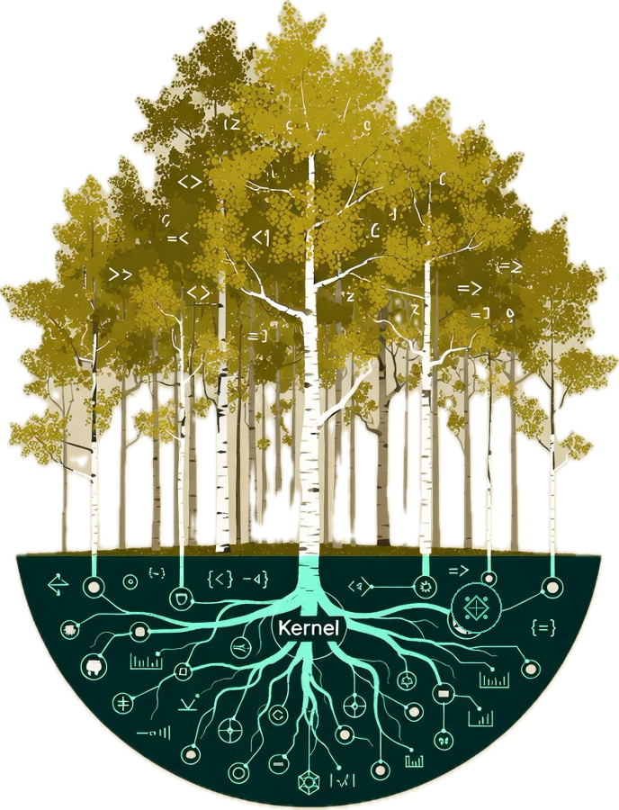

<h1 style="border-bottom: 1px solid #d0d7de; padding-bottom: .3em;">ordered-collections</h1>

**Fast collections that do more than sort.**

Fast, versatile, ordered collections. Drop-in replacements for
`sorted-set` and `sorted-map` — with O(log n) positional access,
parallel fold, and specialized collections for problems you didn't know
you could solve efficiently:

<br clear="left"/>

- **Sets and Maps** work exactly as you're used to, but do more, faster
- **Ropes** for O(log n) concat, split, splice, and insert on large sequences
- **Interval maps** for overlap queries ("what's scheduled at 3pm?")
- **Range maps** for non-overlapping regions ("which subnet owns this IP?")
- **Segment trees** for range aggregation ("total sales from day 10 to 50?")
- **Fuzzy collections** for nearest-neighbor lookup ("snap 9.3 to the closest valid size")
- **Priority queues**, **multisets**, and more

All built from a modular, extensible, weight-balanced tree platform with shared
foundation for splitting, joining, and parallel operations.


[](https://clojars.org/com.dean/ordered-collections)

### Documentation

- [Zorp's Sneaker Emporium](doc/zorp-example.md) — Narrative guide with extended examples
- [Cookbook](doc/cookbook.md) — Practical patterns: leaderboards, time-series, scheduling, queues, multisets, and more
- [Collections API](doc/collections-api.md) — Collection-by-collection constructor and operation reference
- [Ropes](doc/ropes.md) — Rope tutorial, use cases, and design
- [Benchmarks](doc/benchmarks.md) — Detailed performance measurements
- [Competitive Analysis](doc/competitive-analysis.md) — Comparison with other libraries
- [vs clojure.data.avl](doc/vs-clojure-data-avl.md) — For data.avl users considering a switch
- [Algorithms](doc/algorithms.md) — Tree structure, rotations, split/join, interval augmentation
- [Why Weight-Balanced Trees?](doc/why-weight-balanced-trees.md) — Comparison with red-black and AVL trees
- [One Tree, Many Forests](doc/concept/concept.md) — Conceptual architecture and design rationale

---

## Quick Start

Use `ordered-set` and `ordered-map` exactly like
`clojure.core/sorted-set` and `clojure.core/sorted-map`. All the functions you know work the same way. The difference is under the
hood — and in the new things you can do.


```clojure

(require '[ordered-collections.core :as oc])

;; Sets

(def s (oc/ordered-set [3 1 4 1 5 9 2 6]))
(s 4)           ;=> 4
(s 7)           ;=> nil
(conj s 0)      ;=> #{0 1 2 3 4 5 6 9}
(disj s 4)      ;=> #{1 2 3 5 6 9}
(first s)       ;=> 1
(last s)        ;=> 9
(subseq s > 3)  ;=> (4 5 6 9)

;; Maps

(def m (oc/ordered-map {:b 2 :a 1 :c 3}))
(m :b)                  ;=> 2
(assoc m :d 4)          ;=> {:a 1, :b 2, :c 3, :d 4}
(subseq m >= :b <= :c)  ;=> ([:b 2] [:c 3])
```
---

## Performance

Across the measured workloads, `ordered-collections` is faster than
both `clojure.core/sorted-set` and `clojure.data.avl` at every
cardinality  Set algebra is the standout, with 28-57x wins at 500K.
Even against unordered `clojure.core/set`the benchmarks still show
roughly 4-19x wins.

### Set algebra (speedup)

#### vs clojure.core/sorted-set

| Operation | N=10K | N=100K | N=500K |
|-----------|------:|-------:|-------:|
| Union | **15.4x** | **26.4x** | **56.6x** |
| Intersection | **9.0x** | **17.0x** | **36.2x** |
| Difference | **9.6x** | **22.1x** | **50.2x** |

#### vs clojure.data.avl

| Operation | N=10K | N=100K | N=500K |
|-----------|------:|-------:|-------:|
| Union | **10.9x** | **20.5x** | **42.1x** |
| Intersection | **7.2x** | **13.0x** | **28.1x** |
| Difference | **7.2x** | **12.7x** | **32.0x** |

#### vs clojure.core/set

| Operation | N=10K | N=100K | N=500K |
|-----------|------:|-------:|-------:|
| Union | **4.2x** | **7.2x** | **16.3x** |
| Intersection | **3.8x** | **6.1x** | **12.9x** |
| Difference | **4.4x** | **7.6x** | **18.6x** |

### Set equality

| | vs hash-set | vs sorted-set | vs data.avl |
|--|------------:|--------------:|------------:|
| N=10K | **2.8x** | **12.0x** | **14.1x** |
| N=100K | **2.3x** | **9.3x** | **9.5x** |

### Other operations

| Operation | vs sorted-set | vs data.avl |
|-----------|---------------|-------------|
| Construction | **3.0x / 2.8x / 3.1x** | **1.5x / 1.3x / 1.7x** |
| Lookup | 1.1x / 1.1x / 1.1x | 1.0x / 1.0x / 1.0x |
| Split | — | **6.8x / 7.2x / 7.8x** |
| Fold | **2.5x / 4.1x / 4.1x** | **5.8x / 5.9x / 8.8x** |

*Benchmarked on a 2023 MacBook Pro (M2). See [Benchmarks](doc/benchmarks.md) for full results.*

---

## How It Works

The core is a **weight-balanced binary tree**.  Each node knows its
subtree size, enabling O(log n) positional access and efficient parallel
decomposition.

**Split and join** are the fundamental primitives — splitting at a key
produces two trees in O(log n); joining is also O(log n). Set
operations, subrange extraction, and parallel fold all reduce to
split/join. Set operations use Adams' divide-and-conquer algorithm
(1992) extended with the parallel forkl-join based approach from
Blelloch, Ferizovic & Sun (2016).

Collection constructors provide the comparator and node-construction hooks, so
the same tree algorithms can back generic, primitive-specialized, and augmented
variants.

**Augmented trees** extend the basic structure: interval trees store
max-endpoint per subtree for O(log n + k) overlap queries; segment trees
store aggregates for O(log n) range queries.

See [Algorithms](doc/algorithms.md) for implementation details and [Why
Weight-Balanced Trees?](doc/why-weight-balanced-trees.md) for comparison
with red-black and AVL trees.

---

## Collections

The fundamental collection types currently implemented are:
`ordered-set`, `ordered-map`, `rope`, `interval-set`, `interval-map`,
`range-map`, `segment-tree`, `priority-queue`, `ordered-multiset`, `fuzzy-set`,
and `fuzzy-map`.

| Constructor | Description |
|-------------|-------------|
| **Ordered Set** | |
| `(oc/ordered-set coll)` | Sorted set (drop-in for `sorted-set`) |
| `(oc/ordered-set-by pred coll)` | Sorted set with custom comparator |
| `(oc/long-ordered-set coll)` | Sorted set optimized for Long keys |
| `(oc/string-ordered-set coll)` | Sorted set optimized for String keys |
| **Ordered Map** | |
| `(oc/ordered-map coll)` | Sorted map (drop-in for `sorted-map`) |
| `(oc/ordered-map-by pred coll)` | Sorted map with custom comparator |
| `(oc/long-ordered-map coll)` | Sorted map optimized for Long keys |
| `(oc/string-ordered-map coll)` | Sorted map optimized for String keys |
| **Interval Collections** | |
| `(oc/interval-set coll)` | Set supporting interval overlap queries |
| `(oc/interval-map coll)` | Map supporting interval overlap queries |
| **Range Map** | |
| `(oc/range-map)` | Non-overlapping ranges (Guava TreeRangeMap) |
| **Segment Tree** | |
| `(oc/segment-tree f identity coll)` | O(log n) range aggregate queries |
| `(oc/segment-tree-by pred f identity coll)` | Segment tree with custom ordering predicate |
| `(oc/segment-tree-with cmp f identity coll)` | Segment tree with custom Comparator |
| **Priority Queue** | |
| `(oc/priority-queue pairs)` | Priority queue from `[priority value]` pairs |
| **Ordered Multiset** | |
| `(oc/ordered-multiset coll)` | Sorted multiset (allows duplicates) |
| **Rope** | |
| `(oc/rope coll)` | Persistent sequence for structural editing |
| `(oc/rope-concat a b)` | Concatenate two ropes — O(log n) |
| `(oc/rope-splice r start end items)` | Replace a range — O(log n) |
| **Fuzzy Collections** | |
| `(oc/fuzzy-set coll)` | Returns closest element to query |
| `(oc/fuzzy-map coll)` | Returns value for closest key to query |

---

## Ropes

A rope is a persistent sequence optimized for **structural editing** —
concatenation, splitting, splicing, and insertion in the middle of large
sequences. Where `PersistentVector` is O(n) for mid-sequence edits,
the rope is O(log n).

```clojure
(def r (oc/rope (range 100000)))

;; Splice into the middle — O(log n), not O(n)
(def edited (oc/rope-splice r 50000 50010 [:new :data]))

;; Split — O(log n)
(let [[left right] (oc/rope-split r 50000)]
  [(count left) (count right)])  ;=> [50000 50000]

;; Concatenate — O(log n)
(oc/rope-concat (oc/rope [1 2 3]) (oc/rope [4 5 6]))
;=> #ordered/rope [1 2 3 4 5 6]
```

### Rope vs PersistentVector

| Workload | N=10K | N=100K | N=500K |
|---|---:|---:|---:|
| 200 random edits | **43x** | **498x** | **1968x** |
| Single splice | **6x** | **116x** | **584x** |
| Concat many pieces | **3.4x** | **5.4x** | **9.5x** |
| Chunk iteration | **58x** | **83x** | **117x** |
| Reduce (sum) | 0.4x | **1.7x** | **1.3x** |
| Random nth (1000) | 0.7x | 0.5x | 0.4x |

The rope wins on 5 of 6 workloads at scale and the advantage grows with
collection size. Concat improves with N because the rope collects chunks in
O(k) while the vector copies O(n) elements. Reduce beats vectors at N ≥ 100K
thanks to 256-element chunk locality. Random access is slower (O(log n) vs
O(1)) but bounded. See [Ropes](doc/ropes.md) for the full tutorial.

---

## Capabilities

Operations that `sorted-set` and `sorted-map` don't provide — at any collection size.
For the full collection-by-collection surface area, see [Collections API](doc/collections-api.md).

### Positional Access & Rank

```clojure
(def s (oc/ordered-set [50 30 20 40 10]))

(nth s 2)              ;=> 30     O(log n)
(oc/rank s 30)         ;=> 2      O(log n)
(oc/median s)          ;=> 30     O(log n)
(oc/percentile s 90)   ;=> 50     O(log n)
(oc/slice s 1 4)       ;=> (20 30 40)
```

### Nearest / Floor / Ceiling

```clojure
(def s (oc/ordered-set [200 200 400 300 500]))

(oc/nearest s :<= 350)  ;=> 300  (floor)
(oc/nearest s :>= 350)  ;=> 400  (ceiling)
(oc/nearest s :< 300)   ;=> 200  (predecessor)
(oc/nearest s :> 300)   ;=> 400  (successor)
```

### Split & Subrange

```clojure
(def s (oc/ordered-set [5 4 3 1 2]))

(oc/split-key 3 s)  ;=> [#{1 2} 3 #{4 5}]    O(log n)
(oc/split-at 2 s)   ;=> [#{1 2} #{3 4 5}]     O(log n)

;; subrange returns a collection, not a seq
(oc/subrange s :>= 2 :<= 4)  ;=> #{2 3 4}
```

### Interval Queries

```
 meeting: +-------+
   lunch:       +-------+
  review:                 +-------+
         9==10==11==12==13==14==15==16==17
```

```clojure
(def schedule
  (oc/interval-map
    {[9 12] "meeting" [14 17] "review" [11 15] "lunch"}))

(schedule 11)       ;=> ("meeting" "lunch")       point query
(schedule [10 14])  ;=> ("meeting" "lunch" "review")  range query
(oc/span schedule)  ;=> [9 17]
```

### Range Maps

Non-overlapping ranges — each point maps to exactly one value. Inserting
a new range automatically carves out whatever it overlaps.

```clojure
(def tiers
  (-> (oc/range-map)
      (assoc [0 100] :bronze)
      (assoc [100 500] :silver)
      (assoc [500 5000] :gold)))

(tiers 250)                      ;=> :silver
(oc/get-entry tiers 250)         ;=> [[100 500] :silver]
```

Insert a flash-sale range — bronze and silver are automatically split:

```clojure
(oc/ranges (assoc tiers [50 200] :flash))

;; => ([[0 50]    :bronze]        ← auto-trimmed
;;     [[50 200]  :flash]         ← inserted
;;     [[200 500] :silver]        ← auto-trimmed
;;     [[500 5000] :gold])
```

### Segment Trees

```clojure
(def sales (oc/sum-tree {1 100, 2 200, 3 150, 4 300, 5 250}))

(oc/query sales 2 4)     ;=> 650    O(log n)
(oc/aggregate sales)      ;=> 1000   O(1)

;; Update and re-query

(def sales' (assoc sales 3 500))
(oc/query sales' 2 4)     ;=> 1000

;; Also: min-tree, max-tree, or any associative operation

(def peaks (oc/segment-tree max 0 {1 100, 2 200, 3 150}))
(oc/query peaks 1 3)      ;=> 200
```

### Fuzzy Lookup

```clojure
(def sizes (oc/fuzzy-set [6 7 8 9 10 11 12 13]))
(sizes 9.3)                    ;=> 9
(oc/fuzzy-nearest sizes 9.3)   ;=> [9 0.30]

(def tiers (oc/fuzzy-map {0 :bronze 500 :silver 1000 :gold}))
(tiers 480)                    ;=> :silver
```

### Priority Queue & Multiset

```clojure
;; Priority queue (min-heap)

(def pq (oc/priority-queue [[3 :medium] [1 :urgent] [5 :low]]))
(peek pq)       ;=> [1 :urgent]
(peek (pop pq)) ;=> [3 :medium]

;; Multiset (sorted bag, allows duplicates)

(def ms (oc/ordered-multiset [3 1 4 1 5 9 2 6 5 3 5]))
(oc/multiplicity ms 5)  ;=> 3
```

### Parallel Fold

All collection types implement `CollFold` for efficient `r/fold`:

```clojure
(require '[clojure.core.reducers :as r])

(def combinef (fn ([] {}) ([m1 m2] (merge-with + m1 m2))))
(def reducef  (fn [m x] (update m (mod x 100) (fnil inc 0))))

(r/fold combinef reducef (oc/ordered-set (range 1000000)))

;; 1M-element frequency-map workload from the benchmark suite:
;; ~6.9x faster than hash-set reduce, ~4.5x faster than sorted-set fold,
;; ~3.4x faster than data.avl fold
```
---

## Testing

```
$ lein test

Ran 454 tests containing 466,000+ assertions.
0 failures, 0 errors.
```

The test suite includes generative tests via `test.check` and equivalence
tests against `sorted-set`, `sorted-map`, and `clojure.data.avl`.

### Benchmarks

```
$ lein bench                  # Criterium, N=100K (~5 min)
$ lein bench --full           # Criterium, N=10K,100K,500K (~30 min)
$ lein bench --readme --full  # README tables only (~10 min)
$ lein bench --sizes 50000    # Custom sizes

$ lein bench-simple           # Quick iteration bench (100 to 100K)
$ lein bench-simple --full    # Full suite (100 to 1M)
$ lein bench-range-map        # Range-map vs Guava TreeRangeMap
$ lein bench-parallel         # Parallel threshold crossover analysis
```

[Criterium](https://github.com/hugoduncan/criterium) results are written to
`bench-results/<timestamp>.edn`.

---

## Inspiration

The implementation of this weight-balanced binary tree data
structure library was inspired by the following:

-  Adams (1992)
   'Implementing Sets Efficiently in a Functional Language'
   Technical Report CSTR 92-10, University of Southampton.
   <http://groups.csail.mit.edu/mac/users/adams/BB/92-10.ps>

-  Hirai and Yamamoto (2011)
   'Balancing Weight-Balanced Trees'
   Journal of Functional Programming / 21 (3):
   Pages 287-307
   <https://yoichihirai.com/bst.pdf>

-  Oleg Kiselyov
   'Towards the best collection API, A design of the overall optimal
   collection traversal interface'
   <https://okmij.org/ftp/papers/LL3-collections-enumerators.txt>

-  Nievergelt and Reingold (1972)
   'Binary Search Trees of Bounded Balance'
   STOC '72 Proceedings
   4th Annual ACM symposium on Theory of Computing
   Pages 137-142
   <https://dl.acm.org/doi/abs/10.1145/800152.804906>

-  Driscoll, Sarnak, Sleator, and Tarjan (1989)
   'Making Data Structures Persistent'
   Journal of Computer and System Sciences Volume 38 Issue 1, February 1989
   18th Annual ACM Symposium on Theory of Computing
   Pages 86-124
   <https://www.sciencedirect.com/science/article/pii/0022000089900342>

-  MIT Scheme weight balanced tree as reimplemented by Yoichi Hirai
   and Kazuhiko Yamamoto using the revised non-variant algorithm recommended
   integer balance parameters from (Hirai/Yamamoto 2011).
   <https://www.cambridge.org/core/journals/journal-of-functional-programming/article/balancing-weightbalanced-trees/7281C4DE7E56B74F2D13F06E31DCBC5B>

-  Wikipedia
   'Interval Tree'
   <https://en.wikipedia.org/wiki/Interval_tree>

-  Wikipedia
   'Segment Tree'
   <https://en.wikipedia.org/wiki/Segment_tree>

-  Google Guava
   'RangeMap'
   <https://guava.dev/releases/snapshot/api/docs/com/google/common/collect/RangeMap.html>

-  Wikipedia
   'Weight Balanced Tree'
   <https://en.wikipedia.org/wiki/Weight-balanced_tree>

-  Andrew Baine (2007)
   'Purely Functional Data Structures in Common Lisp'
   Google Summer of Code 2007, mentored by Rahul Jain
   <https://funds.common-lisp.dev/funds.pdf>
   <https://developers.google.com/open-source/gsoc/2007/>

- Scott L. Burson
   'Functional Set-Theoretic Collections for Common Lisp'
   <https://fset.common-lisp.dev/>

-  Adams (1993)
   'Efficient sets—a balancing act'
   Journal of Functional Programming 3(4): 553-562
   <https://www.cambridge.org/core/journals/journal-of-functional-programming/article/functional-pearls-efficient-setsa-balancing-act/0CAA1C189B4F7C15CE9B8C02D0D4B54E>

-  Blelloch, Ferizovic, and Sun (2016)
   'Just Join for Parallel Ordered Sets'
   ACM SPAA 2016
   <https://dl.acm.org/doi/10.1145/2935764.2935768>

-  Boehm, Atkinson, and Plass (1995)
   'Ropes: an Alternative to Strings'
   Software: Practice and Experience 25(12)
   <https://www.cs.rit.edu/usr/local/pub/jeh/courses/QUARTERS/FP/Labs/CesswordsII/boehm-ropes.pdf>

-  Haskell containers library (Data.Set, Data.Map)
   <https://hackage.haskell.org/package/containers>

-  SLIB Weight-Balanced Trees (Aubrey Jaffer)
   <https://people.csail.mit.edu/jaffer/slib/Weight_002dBalanced-Trees.html>

-  PAM: Parallel Augmented Maps
   <https://cmuparlay.github.io/PAMWeb/>

---

## License

The use and distribution terms for this software are covered by the [Eclipse Public License 1.0](http://opensource.org/licenses/eclipse-1.0.php), which can be found in the file LICENSE.txt at the root of this distribution. By using this software in any fashion, you are agreeing to be bound by the terms of this license. You must not remove this notice, or any other, from this software.

---

*For extended examples featuring Zorp, Kevin the sentient flip-flop, and Big Toe Tony's 47 feet, see [Zorp's Sneaker Emporium](doc/zorp-example.md).*
