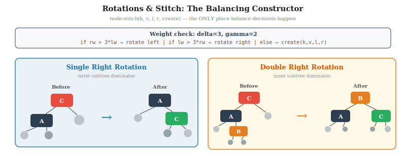
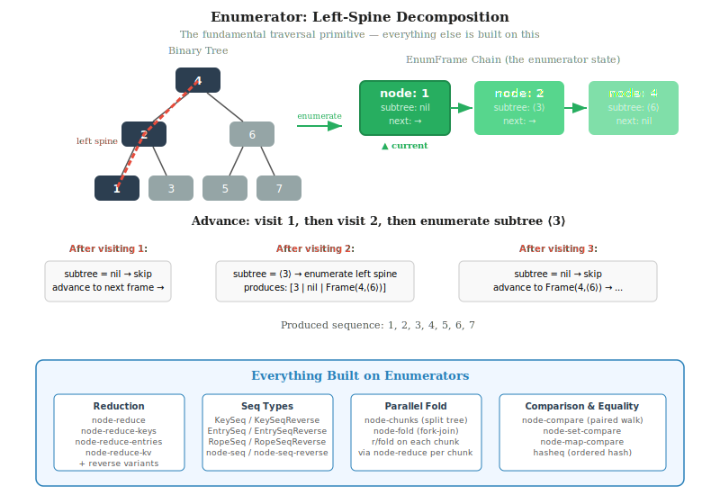
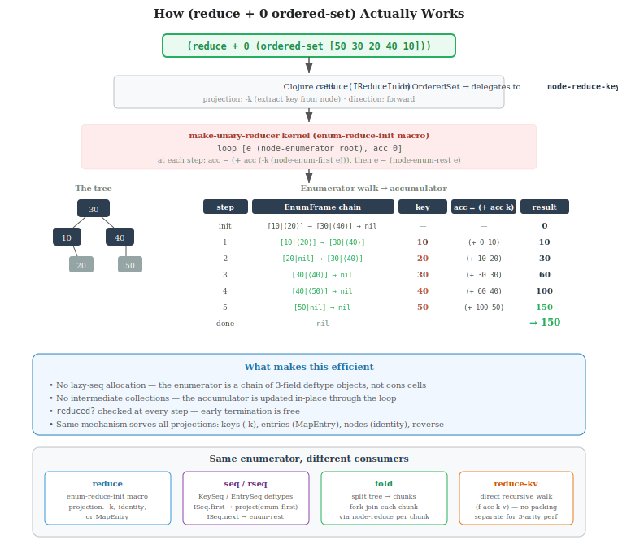

# Algorithms

## Weight-Balanced Trees

Each node stores a key, value, left and right children, and **subtree weight** (= 1 + size(left) + size(right)). Specialized node types exist for performance: `LongKeyNode` (unboxed `long` key), `DoubleKeyNode` (unboxed `double` key), and `IntervalNode` (additional max-endpoint field for interval augmentation).

These are not separate tree implementations. The library uses one shared tree
algebra, parameterized by two hooks: `order/*compare*` for ordering semantics
and `*t-join*` for node reconstruction. Collection constructors bind those at
the boundary, so the same split/join/search code serves generic nodes,
primitive-specialized nodes, and augmented variants.

```
        ┌─────────────────┐
        │  key: 50        │
        │  val: "fifty"   │
        │  weight: 7      │
        └────────┬────────┘
                 │
      ┌──────────┴──────────┐
      ▼                     ▼
 ┌─────────┐          ┌─────────┐
 │ key: 25 │          │ key: 75 │
 │ wt: 3   │          │ wt: 3   │
 └────┬────┘          └────┬────┘
      │                    │
   ┌──┴──┐              ┌──┴──┐
   ▼     ▼              ▼     ▼
 [10]   [30]          [60]   [90]
 wt:1   wt:1          wt:1   wt:1
```

Leaves are a sentinel value (weight 0). The weight field serves double duty: it *is* the balance invariant and it enables O(log n) positional access.

## Balance Invariant

Hirai-Yamamoto parameters (δ=3, γ=2):

```
weight(left)  + 1 ≤ δ × (weight(right) + 1)
weight(right) + 1 ≤ δ × (weight(left)  + 1)
```

No subtree can be more than 3× its sibling's weight. When violated, `stitch-wb` applies a single or double rotation:

- **Single rotation** when the heavy child's *outer* subtree dominates (checked via γ)
- **Double rotation** when the heavy child's *inner* subtree dominates

```
Single right:                Double right:
       [C]       [A]              [C]           [B]
      /   \     /   \            /   \         /   \
    [A]    z  x    [C]         [A]    z      [A]   [C]
   /   \          /   \       /   \         /  \   /  \
  x    [B]      [B]    z    w    [B]       w   x  y   z
                                /   \
                               x     y
```

Hirai & Yamamoto (2011) proved using Coq that (δ=3, γ=2) is the unique integer parameter pair guaranteeing O(log n) height and correct rebalancing for all insert/delete sequences. Height bound: ≤ log₃/₂ n ≈ 1.71 log₂ n.



## Split and Join

Everything reduces to these two primitives.

**Split** divides a tree at a key into (left, found, right):

```
split(tree, 50):

         [40]
        /    \
     [20]    [60]
     /  \    /  \
   [10][30][50][80]

            ↓

 LEFT (<50)       FOUND     RIGHT (>50)
    [40]            50          [60]
    /  \                          \
 [20]  [30]                       [80]
  /
[10]
```

**Join** (`node-concat3`) combines two trees with a pivot key, rebalancing as needed. When the trees are similarly sized, the pivot becomes the root directly. When one side is much heavier, join walks down the heavy side until it finds a subtree of comparable weight, inserts the pivot there, and rebalances upward.

```
join(left, 50, right):

 LEFT           RIGHT             [50]
  [25]           [75]            /    \
  /  \           /  \    →    [25]    [75]
[10] [30]     [60] [90]      /  \    /  \
                            [10][30][60][90]
```

**Join without pivot** (`node-concat2`) extracts the greatest element from the left tree and uses it as the pivot for `node-concat3`. Used by intersection and difference when the split key is absent.

Both split and join are O(log n). The key property of weight-balanced trees: weight composes trivially — `weight(join(L, k, R)) = weight(L) + 1 + weight(R)` — so no auxiliary recomputation (height, color) is needed after joining. This gives WBTs lower constant factors for split/join than AVL or red-black trees.

Because `join` is also the representation hook, the same recursive algorithms
rebuild the correct node type automatically. Different collection variants
inherit the same operation structure while choosing different storage or
augmentation behavior at node construction time.

## Enumerators: The Fundamental Traversal Interface

Below split/join, the tree's basic traversal primitive is the **enumerator**.
An enumerator is a compact explicit traversal state: a chain of frames
representing the current node plus the remaining path to the next node in
sorted order.

The forward enumerator descends the left spine:

```
node-enumerator(root)
  = [current-node | continuation]
```

Advancing the enumerator does two things:
- if the current node has a right subtree, descend that subtree's left spine
- otherwise, resume from the saved continuation

The reverse enumerator is symmetric: descend the right spine, then resume
outward through saved continuations.

Why this matters:
- it gives in-order traversal without recursion or lazy-seq allocation in the hot path
- it is the common substrate for `node-reduce`, `node-reduce-right`, sequence construction, and tree-to-tree linear merges
- it keeps traversal mechanics separate from collection presentation (`seq`, `rseq`, key seqs, entry seqs)

This is close in spirit to Oleg Kiselyov's "Towards the best collection API:
A design of the overall optimal collection traversal interface", which argues
for enumerator-style traversal as the fundamental collection-walking primitive.
The tree code applies that idea at the node level and then builds the public
seq/reduce interfaces on top of it.



Conceptually, the layering is:

```
enumerator         ; explicit tree-walk state
  ↓
node-reduce        ; eager traversal API
node-seq / direct seq types
  ↓
collection seq/reduce interfaces
```

This is why the tree code treats enumerators as fundamental rather than as a
small helper for `seq`. They are the shared low-level traversal interface from
which both eager reduction and Clojure-facing sequence behavior are derived.

## The Reduction Stack

The enumerator feeds into a layered reduction architecture. Unary reducers
(nodes, keys, entries) share a single factory (`make-unary-reducer`) that
combines an enumerator direction with a projection function. The kv reducer
is hand-written separately because its 3-arity `(f acc k v)` shape doesn't
fit the unary projection model — forcing it through a projection would require
packing k and v into a MapEntry just to unpack them. Direct seq types
(`KeySeq`, `EntrySeq`) walk the enumerator without lazy-seq allocation.
Parallel fold splits the tree into chunks (via positional split) and reduces
each chunk independently.



## The Join-Based Paradigm

All tree operations reduce to split and join (Adams 1992, Blelloch et al. 2016):

| Operation | Implementation |
|-----------|----------------|
| insert(k, v) | split at k, join with new node |
| delete(k) | split at k, join left and right |
| union(A, B) | split A at root(B), recurse on halves, join |
| intersection(A, B) | split A at root(B), recurse, join if found, concat if not |
| difference(A, B) | split A at root(B), recurse, concat halves |

Balance logic lives only in join. All operations inherit O(log n) balancing automatically.

## Set Operations

Union, intersection, and difference use Adams' divide-and-conquer:

```
union(T₁, T₂):
  if T₁ empty: return T₂
  if T₂ empty: return T₁
  (k, v) = root(T₂)
  (L₁, _, R₁) = split(T₁, k)
  return join(union(L₁, left(T₂)), k, v, union(R₁, right(T₂)))

intersection(T₁, T₂):
  if T₁ empty or T₂ empty: return ∅
  (k, v) = root(T₂)
  (L₁, present, R₁) = split(T₁, k)
  L = intersection(L₁, left(T₂))
  R = intersection(R₁, right(T₂))
  if present: return join(L, k, v, R)
  else:       return concat(L, R)

difference(T₁, T₂):
  if T₁ empty: return ∅
  if T₂ empty: return T₁
  (k, _) = root(T₂)
  (L₁, _, R₁) = split(T₁, k)
  return concat(difference(L₁, left(T₂)), difference(R₁, right(T₂)))
```

**Work complexity:** O(m log(n/m + 1)) where m ≤ n. This is information-theoretically optimal — it matches the comparison-based lower bound. When m ≪ n (e.g., merging a small set into a large one), this approaches O(m log n). When m ≈ n, it's O(n). The naive element-by-element insertion approach is always O(m log n), which is worse when m is large.

### Parallelism

The two recursive calls in each operation are independent. The implementation forks the left recursion as a `ForkJoinTask` and computes the right recursion inline, then joins:

```
fork-join:
  left-task  = fork(union(L₁, left(T₂)))   ← submitted to ForkJoinPool
  right-result = union(R₁, right(T₂))       ← computed inline
  left-result  = left-task.join()            ← wait for fork
  return join(left-result, k, v, right-result)
```

The current implementation uses operation-specific root thresholds:
- union: `131,072`
- intersection: `65,536`
- difference: `131,072`
- ordered-map merge: `65,536`

Below those root thresholds, the operations stay sequential. Once in the
parallel path, recursive splits re-fork at `65,536`, subject to the branch-shape
guard described below. Tiny subtrees still use the direct sequential cutoff of
`64`.

Span is O(log² n), giving near-linear speedup on many cores (Blelloch et al. 2016).

## Fork-Join Parallelism

Six operations use Java's `ForkJoinPool` for automatic parallelism: union, intersection, difference, merge-with, and two forms of parallel fold. Set operations use the three-layer fork-join pattern directly; fold delegates to `clojure.core.reducers/fold`.

### The pattern

Every parallel operation has three layers:

```
┌─────────────────────────────────────────────────────────────┐
│  Entry point                                                │
│  Is the caller already in a ForkJoinPool worker thread?     │
│    yes → call par-fn directly                               │
│    no  → submit par-fn to the common pool via .invoke       │
├─────────────────────────────────────────────────────────────┤
│  par-fn (parallel recursion)                                │
│  Is the subtree large enough to justify forking?            │
│    yes → fork left subtree, compute right inline, join      │
│    no  → call seq-fn                                        │
├─────────────────────────────────────────────────────────────┤
│  seq-fn (sequential recursion)                              │
│  Same algorithm, no fork overhead                           │
└─────────────────────────────────────────────────────────────┘
```

### Why the pool entry point is needed

`ForkJoinTask.fork()` can only be called from within a `ForkJoinPool` worker thread. When user code calls `union` from a regular thread (e.g. the main thread or a core.async thread), the operation must first be submitted to the pool. Once inside the pool, recursive calls are already on worker threads and can fork directly:

```
(if (ForkJoinTask/inForkJoinPool)
  (par-fn root)                          ;; already inside pool
  (.invoke fork-join-pool                ;; enter pool
    (ForkJoinTask/adapt (fn [] (par-fn root)))))
```

### Task representation

The hot recursive path no longer goes through `Callable` plus
`ForkJoinTask/adapt`, and it no longer relies on repeated dynamic-var rebinding.
Instead, the sequential and parallel kernels use explicit-argument helpers
(`cmp`, `create`) and fork a small internal `RecursiveTask` wrapper.

That matters because the set-algebra recursion is fine-grained: if task
creation, comparator rebinding, or closure allocation are too expensive, the
practical crossover climbs far above where the algorithm should pay off.

### Threshold tuning

Parallelism uses four guards to keep fork overhead from dominating:

| Threshold | Value | Purpose |
|-----------|-------|---------|
| `union` root threshold | 131,072 | Enter parallel union only above this combined subtree size |
| `intersection` root threshold | 65,536 | Enter parallel intersection only above this combined subtree size |
| `difference` root threshold | 131,072 | Enter parallel difference only above this combined subtree size |
| `merge` root threshold | 65,536 | Enter parallel ordered-map merge only above this combined subtree size |
| recursive threshold | 65,536 | Once already in the parallel path, re-fork only above this combined subtree size |
| `+parallel-min-branch+` | 65,536 | Only fork when both recursive branches are substantive enough |
| `+sequential-cutoff+` | 64 | Subtree size below which set operations use direct linear merge |
| `+min-fold-chunk-size+` | 4,096 | Minimum chunk size for parallel fold (floor on user-supplied value) |

The root thresholds are operation-specific because one conservative value left
too many practical wins on the table. Union and difference reconstruct more
output than intersection; merge behaves differently again; comparator cost and
tree shape also matter. The fold chunk floor prevents excessive O(log n) tree
splits when `r/fold`'s default chunk size (256) would create too many chunks.

`parallel_threshold_bench.clj` is useful for local tuning, but it does not
produce one stable crossover point across machines. In the April 2, 2026
reruns, the production-path benchmark favored per-operation entry thresholds
plus a lower recursive threshold and a branch-shape guard. That matches the
actual workload differences between union, intersection, difference, and
ordered-map merge more closely than a single universal threshold.

### Operations using this pattern

**Set operations** (union, intersection, difference, merge-with): The tree's divide-and-conquer structure maps directly to fork-join. Split T₁ at T₂'s root, fork the left halves, compute the right halves inline, join results. Work O(m log(n/m + 1)), span O(log² n).

**Parallel fold** (`node-fold`): Split the tree into roughly equal subtrees using `node-split` at evenly-spaced positions, then fold them in parallel via `r/fold`. Splitting is done eagerly in the caller's thread (where dynamic bindings are available); each chunk's sequential reduce uses `node-reduce` which needs no bindings. Work O(n), span O(n/p + k log n) where k is the number of chunks.

## Positional Access

Weight at each node enables O(log n) index operations without any additional data structure.

### nth (index → element)

```
nth(tree, i):
  left-size = weight(left)
  if i < left-size:  recurse into left
  if i == left-size: return this node
  else:              recurse into right with i' = i - left-size - 1
```

### rank (element → index)

Accumulate left subtree sizes while descending:

```
rank(tree, key):
  acc = 0
  if key < node.key: recurse left, keep acc
  if key = node.key: return acc + weight(left)
  if key > node.key: acc += weight(left) + 1, recurse right
```

### Derived operations

- **slice(start, end)**: split-at start, split-at (end - start) on the right half
- **median**: nth at ⌊n/2⌋
- **percentile(p)**: nth at ⌊n × p / 100⌋

All O(log n). Available on `ordered-set`, `ordered-map`, `fuzzy-set`, `fuzzy-map`.

## Nearest (Floor / Ceiling)

`ordered-set` and `ordered-map` implement directional nearest-neighbor via tree descent:

| Test | Meaning |
|------|---------|
| `:<=` | floor — greatest element ≤ k |
| `:<` | predecessor — greatest element < k |
| `:>=` | ceiling — least element ≥ k |
| `:>` | successor — least element > k |

Standard BST descent with candidate tracking. O(log n).

## Parallel Fold

Collections implement `clojure.core.reducers/CollFold` via `node-fold`. The tree is split into roughly equal chunks using `node-split`; those chunks are then folded in parallel by `clojure.core.reducers/fold`.

Minimum chunk size: **`+min-fold-chunk-size+` = 4,096**. User-supplied chunk sizes below that floor are rounded up to avoid excessive tree splitting overhead.

Span is approximately O(n/p + k log n), where `p` is processor count and `k` is the number of chunks.

## Interval Tree Augmentation

`IntervalNode` adds a field `z`: the maximum right endpoint in the subtree. This is maintained during rotations — each node's `z` is the max of its own interval's endpoint and its children's `z` values.

```
      ┌─────────────────────┐
      │  interval: [3,7]    │
      │  max-end: 15        │  ← max of all endpoints in subtree
      └─────────┬───────────┘
                │
     ┌──────────┴──────────┐
     ▼                     ▼
┌─────────┐          ┌─────────┐
│ [1,5]   │          │ [8,15]  │
│ max: 5  │          │ max: 15 │
└────┬────┘          └────┬────┘
     │                    │
  ┌──┴──┐              ┌──┴──┐
  ▼     ▼              ▼     ▼
[0,2] [4,6]         [6,10] [12,15]
max:2 max:6         max:10 max:15
```

### Query algorithm

The implementation supports both point queries and interval-vs-interval overlap queries. Given a query interval `i`:

```
search(node, i):
  if leaf: return

  # Search right if query's endpoint ≥ node's start point
  if b(i) >= a(node.key):
    search(right, i)

  # Check current node for intersection
  if intersects?(i, node.key):
    collect(node)

  # Search left only if query's start ≤ max endpoint in left subtree
  if a(i) <= left.z:
    search(left, i)
```

`intersects?` checks for any common point between two intervals (overlap, containment in either direction). The `z` field enables pruning: if `left.z < a(query)`, no interval in the left subtree can overlap the query.

Complexity: O(log n + k) where k = number of matching intervals.

Point queries are a special case: a point `p` is treated as the interval `[p, p]`.

## Range Map

`range-map` enforces non-overlapping ranges. Each point maps to exactly one value. Ranges are half-open: `[lo, hi)`.

### Insert (assoc)

Inserting `[25, 75) → :new` into a tree containing `[0, 100) → :a`:

```
Step 1: Find all ranges overlapping [25, 75)
  → [[0, 100) → :a]

Step 2: Remove overlapping ranges from tree

Step 3: Re-insert trimmed portions outside [25, 75)
  → [0, 25) → :a,  [75, 100) → :a

Step 4: Insert new range
  → [0, 25) → :a,  [25, 75) → :new,  [75, 100) → :a
```

### Coalescing insert (assoc-coalescing)

When adjacent ranges have the same value, merge them:

```
Before: [0, 50) → :a    [50, 100) → :a   (two ranges)
Insert [100, 150) → :a with coalescing:
After:  [0, 50) → :a    [50, 150) → :a   (adjacent merged)
```

Complexity: O(k log n) where k = number of overlapping/adjacent ranges.

## Segment Tree

Each `AggregateNode` stores a pre-computed aggregate (`agg`) of its entire subtree under a user-specified associative operation. Created via a custom node constructor that computes `agg = op(left.agg, op(value, right.agg))` at every node.

```
                ┌─────────────┐
                │ key: 3      │
                │ val: 40     │
                │ agg: 150 ◄──────── sum of entire tree
                └──────┬──────┘
           ┌───────────┴───────────┐
    ┌──────┴──────┐         ┌──────┴──────┐
    │ key: 1      │         │ key: 4      │
    │ val: 20     │         │ val: 50     │
    │ agg: 30     │         │ agg: 80     │
    └──────┬──────┘         └──────┬──────┘
           │                       │
    ┌──────┴──────┐         ┌──────┴──────┐
    │ key: 0      │         │ key: 5      │
    │ val: 10     │         │ val: 30     │
    │ agg: 10     │         │ agg: 30     │
    └─────────────┘         └─────────────┘
```

### Range query

Two implementations: `query-range` (basic) and `query-range-fast` (uses subtree bounds to short-circuit).

```
query-range-fast(node, lo, hi):
  if leaf: return identity

  # Find subtree's actual key range
  l-lo = min key in left subtree (or node.key if left is leaf)
  r-hi = max key in right subtree (or node.key if right is leaf)

  # Entire subtree outside range
  if r-hi < lo or l-lo > hi: return identity

  # Entire subtree inside range → use pre-computed aggregate!
  if lo ≤ l-lo and r-hi ≤ hi: return node.agg

  # Partial overlap → recurse
  L = query-range-fast(left, lo, hi)
  V = node.val if lo ≤ node.key ≤ hi, else identity
  R = query-range-fast(right, lo, hi)
  return op(L, op(V, R))
```

The key optimization: when a subtree is entirely within the query range, return its `agg` directly instead of recursing. This gives O(log n) for both queries and updates.

## Fuzzy Lookup

Fuzzy collections find the closest element by distance. The algorithm uses split:

```
find-nearest(tree, query):
  (left, exact, right) = split(tree, query)

  if exact: return exact

  floor   = greatest(left)    ← O(log n)
  ceiling = least(right)      ← O(log n)

  return argmin(|query - floor|, |query - ceiling|)
```

When equidistant, a configurable tiebreaker (`:< ` or `:>`) determines preference. The `distance-fn` is also configurable (defaults to numeric absolute difference).

**Invariant:** The nearest element by distance is always a sort-order neighbor (floor or ceiling), so split gives us the only two candidates. O(log n).

## Handling Duplicates

`ordered-multiset` and `priority-queue` allow duplicate keys by appending an internal sequence counter.

**Multiset** stores `[value, seqnum]` pairs. Comparison: first by value, then by seqnum. This gives stable insertion order for equal values and FIFO behavior on removal.

**Priority queue** stores `[priority, seqnum, value]` triples. Sorted by priority first, then seqnum. `peek` returns the minimum-priority element; among equal priorities, the earliest inserted.

## Complexity Summary

| Operation | Time | Notes |
|-----------|------|-------|
| Lookup | O(log n) | All collections |
| Insert / Delete | O(log n) | Persistent (path copying) |
| nth / rank | O(log n) | Via subtree weights |
| median / percentile | O(log n) | Via nth |
| nearest (floor/ceiling) | O(log n) | Ordered sets and maps |
| Split (by key or index) | O(log n) | |
| Join | O(log n) | Universal primitive |
| Union / Intersection / Difference | O(m log(n/m+1)) | Work-optimal, fork-join parallel |
| Parallel fold | O(n/p + log²n) | p = processors |
| Interval query | O(log n + k) | k = result count |
| Range-map assoc | O(k log n) | k = overlapping ranges |
| Segment-tree query | O(log n) | Pre-computed aggregates |
| Fuzzy lookup | O(log n) | Split + floor/ceiling |
| Rope nth | O(log n) | Descent by element counts |
| Rope concat | O(log n) | Structural join |
| Rope split | O(log n) | Split-join with concat3 |
| Rope splice / insert / remove | O(log n) | Split + concat |
| Rope reduce | O(n) | Chunk-aware traversal |
| Rope parallel fold | O(n/p + log²n) | Fork-join over split halves |

## Ropes: Implicit-Index Chunk Trees

A rope is a persistent sequence built on the same weight-balanced tree
infrastructure, but with a fundamentally different indexing model. Where
ordered sets and maps use a comparator to position elements by key, a rope
uses **positional indexing** — the element's position in the sequence is
determined entirely by subtree element counts.

### Node Representation

Each rope node reuses `SimpleNode` with repurposed fields:

```
        ┌────────────────────────┐
        │  k: chunk [a b c ...]  │   ← vector of elements (the "chunk")
        │  v: 1042               │   ← total element count of subtree
        │  x: 9                  │   ← node count (for WBT balance)
        │  l: ●  r: ●            │
        └────────────────────────┘
```

Two distinct size metrics coexist:

- `tree/node-size` (field `x`) — **node count**, used by WBT rotations
- `rope-size` (field `v`) — **element count**, used for indexed access

This separation is essential. The tree stays balanced by node count (so all the
existing rotation machinery works unchanged), while indexed operations descend
by element count.

### Chunk Size Invariant (CSI)

Chunks are bounded by a formal invariant analogous to B-tree minimum fill:

```
target = 1024    min = 512    (per-variant, kernel-wide default)

Every chunk has size in [min, target] except:
  - If the rope has ≤ 1 chunk, it may be any size in [1, target]
  - Otherwise, only the rightmost chunk (the "runt") may be [1, target]
```

Each rope variant (`rope`, `string-rope`, `byte-rope`) carries its own
`+target-chunk-size+` / `+min-chunk-size+` constants and binds them into
the kernel's `*target-chunk-size*` / `*min-chunk-size*` dynamic vars via
its `with-tree` macro. The values above are the current tuned defaults;
`lein bench-rope-tuning` sweeps candidate sizes for each variant.

CSI is enforced locally at each mutation site:

| Operation | Enforcement |
|---|---|
| `rope-concat` | Position-aware boundary check: l's rightmost becomes internal (must be ≥ min); r's leftmost only needs fixing if r has ≥ 2 chunks. `merge-boundary` pulls one neighbor when combined boundary < min. |
| `rope-split` | `ensure-split-parts` repairs the right fringe of the left half and the left fringe of the right half. |
| `rope-sub` | `ensure-left-fringe` + `ensure-right-fringe` after recursive extraction. |
| `rope-conj-right` | Fills rightmost chunk up to target; overflows to new node. |
| `coll->root` | `partition-all target` always produces valid chunks. |

`rechunk-balanced` is the core partitioning helper: it packs greedily at target
size, but when the last full chunk would leave a remainder below min, it splits
the final two pieces evenly so both halves are ≥ min.

### Flat Mode

Below the target chunk size, a rope would consist of exactly one chunk
wrapped in a single tree node. That wrapper adds no information, so
every rope variant applies a **flat-mode** optimization: when the
element count is at or below the flat threshold (= `+target-chunk-size+`,
currently 1024), the rope stores its content as a bare concrete
collection in its `root` field — a `PersistentVector` for the generic
rope, a `java.lang.String` for the string rope, a `byte[]` for the byte
rope — and skips the tree wrapper entirely.

Reads dispatch directly to the underlying type's native operations with
zero indirection (`.nth` on the vector, `.charAt` on the string,
`aget` on the byte array). Structural edits use the native type's
own efficient operations (`subvec`+`into`, `StringBuilder`,
`System.arraycopy`) and promote to the chunked tree form only when
the result would exceed the threshold. Transient construction always
builds a tree internally but demotes back to flat form at
`persistent!` time if the final result fits.

The flat threshold is `+target-chunk-size+` — "small enough to live in
one chunk" and "small enough to stay flat" are the same regime. Memory
overhead for a flat-mode rope is essentially identical to the raw
underlying type.

### Indexed Access

`rope-nth` descends by subtree element counts:

```
rope-nth(node, i):
  ls = element-count(left)
  cs = chunk-size(node)
  if i < ls:            recurse into left
  if i < ls + cs:       return chunk[i - ls]
  else:                 recurse into right with i' = i - ls - cs
```

Cost: O(log n) — one comparison per tree level, then a constant-time vector
lookup within the chunk.

### Split

`rope-split-at` follows the standard split-join pattern from Blelloch et al.,
adapted for positional indexing. The key optimization: it uses `rope-join`
(a concat3 — balanced join with a known pivot chunk) during unwind rather than
`raw-rope-concat` (concat2, which must extract a pivot).

```
rope-split(node, i):
  ls = element-count(left)
  cs = chunk-size(node)

  if i < ls:
    (ll, lr) = rope-split(left, i)
    return (ll, rope-join(chunk, lr, right))    ← concat3, O(|height diff|)

  if i within chunk:
    split the chunk vector via subvec
    return (concat(left, left-piece), concat(right-piece, right))

  if i > ls + cs:
    (rl, rr) = rope-split(right, i - ls - cs)
    return (rope-join(chunk, left, rl), rr)
```

`rope-join` is O(|height(l) - height(r)|) per call, and the height differences
telescope across levels, giving **O(log n) total** for the full split. The
earlier implementation used concat2 at each level, which was O(log²n).

### Concatenation

`rope-concat` is the rope's fundamental structural operation. For the common
case (both boundary chunks ≥ min), it delegates directly to `raw-rope-concat`
— the standard WBT join, O(log n).

When boundary chunks need repair (the left tree's rightmost was a runt that
now becomes internal), `merge-boundary` removes the two boundary chunks,
combines them, rechunks, and rebuilds. If the combined content is still below
min, it pulls one additional neighbor chunk — at most one level of cascading.

### Subrope (Range Extraction)

`rope-sub` does direct recursive range extraction rather than split-twice:

```
slice(node, start, end):
  if range fully covers node: return node    ← full subtree sharing
  left-part  = slice(left,  start, min(end, ls))
  mid-part   = subvec chunk at boundaries
  right-part = slice(right, max(0, start-rs), end-rs)
  return concat(concat(left-part, mid-part), right-part)
```

This reuses whole subtrees when the requested window fully contains them,
taking chunk subvecs only at the two cut boundaries. Fringe normalization
is applied once at the end.

### Transient Tail Buffer

`TransientRope` uses a mutable `ArrayList` as a tail buffer. `conj!` appends
to the tail in O(1); when the tail reaches target chunk size (256 elements),
it is flushed into the persistent tree via `rope-concat`. This amortizes tree
operations over 256 element appends, cutting build time roughly in half
compared to persistent `conj`.

```
conj!(transient, x):
  tail.add(x)
  if tail.size >= target:
    chunk = vec(tail)
    tail.clear()
    root = rope-concat(root, coll->root(chunk))

persistent!(transient):
  flush remaining tail
  return Rope(root)
```

### Why Not a Comparator?

The rope deliberately avoids the library's `order/*compare*` / `tree/*t-join*`
dynamic variable hooks. Position is the ordering — there is no meaningful key
to compare. This means the rope cannot reuse `node-split`, `node-concat3`,
or the comparator-driven add/remove paths. Instead, it has its own
position-aware equivalents (`rope-split-at`, `rope-join`, `rope-nth`, etc.)
that thread through the tree by element count rather than key comparison.

The shared infrastructure it *does* reuse: `node-stitch` (rotation logic),
`node-weight` (balance metric), `SimpleNode` (storage), and the enumerator /
reducer machinery for traversal.

### Performance vs PersistentVector

```
Rope WINS (advantage grows with N):

┌────────────────────┬───────┬────────┬────────┬──────────────────────┐
│      Workload      │ N=10K │ N=100K │ N=500K │      Asymptotic      │
├────────────────────┼───────┼────────┼────────┼──────────────────────┤
│ 200 random edits   │   43x │   498x │  1968x │ O(k·log n) vs O(k·n) │
│ Single splice      │    6x │   116x │   584x │ O(log n) vs O(n)     │
│ Concat many pieces │  3.4x │   5.4x │   9.5x │ O(k) vs O(n)         │
│ Chunk iteration    │   58x │    83x │   117x │ natural structure     │
│ Reduce (sum)       │  0.4x │   1.7x │   1.3x │ 256-elem chunk wins  │
└────────────────────┴───────┴────────┴────────┴──────────────────────┘

Rope loses (bounded, inherent O(log n) vs O(1)):

┌────────────────────┬───────┬────────┬────────┐
│      Workload      │ N=10K │ N=100K │ N=500K │
├────────────────────┼───────┼────────┼────────┤
│ Split              │   19x │     7x │    21x │
│ Slice              │   65x │    51x │    24x │
│ Random nth (1000)  │  1.6x │   1.9x │   2.5x │
└────────────────────┴───────┴────────┴────────┘
```

Reduce beats vectors at N ≥ 100K because the rope's 1024-element chunk size
gives better cache locality per reduction step than PersistentVector's 32-wide
trie nodes. The direct recursive tree walk (no enumerator frames) and native
vector `.reduce` delegation keep per-element overhead minimal.

At N ≤ 1024 the rope is in **flat mode** — the root holds a bare
`PersistentVector` directly rather than a one-chunk tree, so every read
dispatches straight to the underlying vector with zero indirection. At
that size, the rope's read performance is essentially identical to
`PersistentVector` itself.

Every remaining loss is structural — there are no non-inherent performance gaps:

```
┌─────────────────────┬──────────┬───────────────────────────────────────────────────┐
│        Loss         │  Ratio   │                   Why inherent                    │
├─────────────────────┼──────────┼───────────────────────────────────────────────────┤
│ Split/slice         │ ~15-60x  │ O(log n) tree walk vs O(1) subvec wrapper         │
│ Random nth          │ 1.3-2.6x │ O(log n) tree descent vs O(1) trie lookup         │
│ Reduce at 10K       │ 0.6x     │ Fixed tree-walk overhead for 39 chunks            │
│ Build via transient │ 2.2-2.6x │ Periodic O(log n) tree flush vs O(1) array append │
│ Build via conj      │ 12-18x   │ O(log n) per append vs O(1) amortized             │
└─────────────────────┴──────────┴───────────────────────────────────────────────────┘
```

Split/slice/nth are the price of tree-backed indexing — `subvec` wraps the
existing vector in constant time, while the rope must walk its tree. The
absolute times are microseconds (5-12µs for split, ~250µs for 1000 random
nths). Construction is best done via `(oc/rope coll)` which is a single O(n)
chunking pass, not element-by-element `conj`.

The editing wins are unbounded: each mid-sequence edit on a vector copies O(n)
elements, while the rope does O(log n) tree work. At 500K elements, 200 random
edits take 3ms on the rope vs 5.4 seconds on the vector.

### References

- Boehm, Atkinson & Plass (1995): "Ropes: an Alternative to Strings" — the canonical rope paper; lazy concatenation, Fibonacci rebalancing, stack-based iteration
- Blelloch, Ferizovic & Sun (2016): "Just Join for Parallel Ordered Sets" — the split-join paradigm that the rope's `rope-split-at` / `rope-join` follows

---

## References

- Adams (1992): "Implementing Sets Efficiently in a Functional Language" — split/join paradigm, divide-and-conquer set operations
- Adams (1993): "Efficient sets—a balancing act" — elegant functional pearls treatment
- Hirai & Yamamoto (2011): "Balancing Weight-Balanced Trees" — Coq-verified (δ=3, γ=2) parameters
- Blelloch, Ferizovic & Sun (2016): "Just Join for Parallel Ordered Sets" — work-optimality proof, parallel algorithms
- Sun, Ferizovic & Blelloch (2018): "PAM: Parallel Augmented Maps" — augmented tree framework (interval/segment trees)
