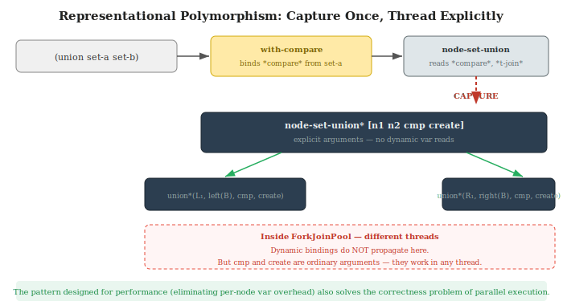
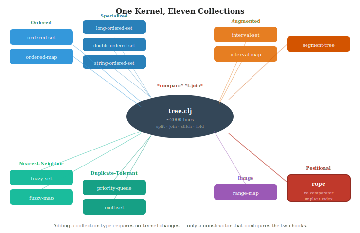
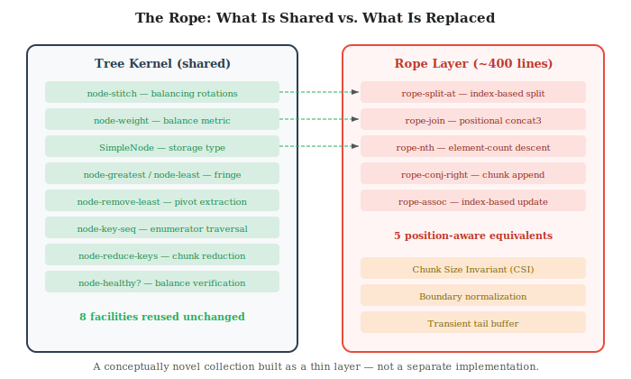

# One Tree, Many Forests: Representational Polymorphism in a Parallel Split/Join Tree Algebra

*A Weight-Balanced Kernel for Persistent Sets, Maps, Intervals, Segments, Ropes, and Beyond*

**Dan Lentz**

---

## Abstract

We describe *ordered-collections*, a Clojure library in which a single
weight-balanced tree algebra kernel serves as the substrate for eleven
persistent collection types. The kernel is parameterized by a small set of
open extension points -- a comparator for ordering, a node constructor for
representation, and a set of root-level interfaces for collection identity --
through which collection types configure the shared infrastructure without
modifying it. We call this design pattern *representational polymorphism*:
dynamic binding variables are captured once at collection boundaries and
threaded as explicit arguments through hot recursive paths, achieving the
flexibility of dynamic dispatch with the performance of static
parameterization. This same pattern enables automatic fork-join parallelism
on set algebra, because the captured context propagates correctly into forked
threads where dynamic bindings would not. We present the abstraction
architecture and test its generality against three increasingly demanding
challenges: parallel set algebra (same node types, different threads),
augmented trees (different node types, same comparator), and a chunked
persistent rope (no comparator at all). Benchmark evidence confirms the
approach yields strong performance (28-57x on parallel set algebra, up to
1968x on rope structural editing) without sacrificing generality.

We use the term *representational polymorphism* to mean polymorphism over
concrete collection representation within a shared kernel. This usage is
unrelated to GHC's representation polymorphism over runtime value
representation.

---

## 1. Introduction

Persistent data structures are foundational to functional programming. A
typical functional language runtime provides a handful of built-in persistent
collections -- vectors, hash maps, sorted maps -- each implemented as a
standalone data structure with its own balancing scheme, traversal machinery,
and persistence mechanism. When a programmer needs an interval tree, a
segment tree, a rope, or a priority queue, they must find or build a separate
implementation from scratch.

This fragmentation has compounding costs. Each implementation independently
solves the same subproblems: balancing, persistence through path copying,
traversal, reduction, parallel decomposition. Optimizations applied to one
structure -- parallel fold, primitive key specialization, enumerator-based
reduction -- must be independently rediscovered and applied to each. The
result is an ecosystem of isolated implementations that share nothing.

We present an alternative architecture. A single tree algebra kernel,
approximately 2000 lines of Clojure, provides the shared substrate for
eleven persistent collection types. The kernel implements all structural
operations -- rotations, split, join, set algebra, positional access,
traversal, parallel decomposition -- parameterized by a small, well-chosen
set of extension points. Collection types are thin layers that configure
these extension points and wrap the kernel's operations in type-appropriate
semantics.

The central insight is that weight-balanced trees with the split/join
paradigm (Adams 1992; Blelloch, Ferizovic & Sun 2016) have an unusually
clean factoring of concerns. Balance logic lives only in `join`. The
recursive decomposition of every operation is independent of key ordering
and node representation. This creates a natural extensibility boundary that
we exploit through a pattern we call *representational polymorphism*.

### Contributions

1. **Representational polymorphism** as a design pattern for parameterizing
   persistent tree kernels in dynamically-typed languages.

2. **A layered abstraction architecture** with five distinct extension
   points that together support eleven collection types from one kernel.

3. **Three tests of generality**: parallel set algebra (testing thread
   safety), augmented trees (testing node extensibility), and a chunked
   persistent rope (testing the architecture's limits with a non-comparator
   collection type that has no prior Clojure implementation).

4. **Benchmark evidence** that this generality does not cost performance.

---

## 2. Foundation

### 2.1 Why Weight-Balanced Trees

The choice of balancing scheme is not incidental -- it is the architectural
foundation that makes everything else possible.

Weight-balanced trees (Nievergelt & Reingold 1972) store a subtree size at
each node and maintain balance by bounding the ratio of sibling weights.
Using the parameters delta=3, gamma=2 -- the unique valid integer pair,
proven correct by Hirai & Yamamoto (2011) via Coq -- the height bound is
log\_{3/2} n ~ 1.71 log\_2 n.

Weight-balanced trees have three properties that distinguish them from AVL
and red-black trees for our purposes:

**Weight composes trivially after join.** After joining two subtrees with a
pivot, the new weight is `weight(left) + 1 + weight(right)`. No auxiliary
data (height, color, rank) needs recomputation. This gives WBTs the lowest
constant factor for split/join of any practical balanced tree family.

**The weight field IS the balance invariant AND the positional index.** The
same `x` field that maintains tree balance also supports O(log n) nth, rank,
slice, median, and percentile. No secondary data structure is needed for
positional access.

**The weight field composes with augmented data.** Interval tree
max-endpoints, segment tree aggregates, and rope element counts all compose
in the same framework as the weight itself -- computed during node
construction and propagated automatically through rotations.

### 2.2 The Split/Join Paradigm

Adams (1992) showed that all tree operations reduce to two primitives:

- **Split(tree, key)** → (left, found, right) in O(log n)
- **Join(left, key, right)** → balanced tree in O(|height diff|)

Insert is split + join. Delete is split + join. Union, intersection,
difference are recursive split + join. Subrange extraction, positional
split, fold -- all split + join.

The critical property: **balance logic lives only in join.** Every operation
inherits correct balancing automatically. This is the factoring that creates
the kernel's extensibility boundary: the recursive structure of every
operation is independent of how nodes are constructed. The kernel provides
the structure; the extension points provide the representation.

Blelloch, Ferizovic & Sun (2016) formalized this paradigm, proved it
work-optimal (O(m log(n/m+1)) for set operations), and showed the span is
O(log^2 n) -- enabling near-linear parallel speedup.

---

## 3. The Architecture

The architecture has five layers, each providing a distinct extension point.
Together they form a stack that transforms a generic tree algebra into a
family of specialized persistent collections.


### 3.1 Layer 1: Node Interfaces

At the lowest level, three Java interfaces define what a tree node IS:

```
INode          — k(), v(), l(), r(), kv()     core fields
IBalancedNode  — x()                          balance metric (weight)
IAugmentedNode — z()                          auxiliary per-subtree data
```

Every node type implements `INode` and `IBalancedNode`. Augmented types
additionally implement `IAugmentedNode`. The kernel accesses all node fields
through these interfaces, never through concrete types. Field accessors use
`definline` for zero-overhead inlining.

This abstraction allows five concrete node types to share one tree algebra:

```
SimpleNode    [k v l r ^long x]          general purpose
LongKeyNode   [^long k v l r ^long x]    unboxed long keys
DoubleKeyNode [^double k v l r ^long x]  unboxed double keys
IntervalNode  [k v l r ^long x z]        max-endpoint augmentation
AggregateNode [k v l r ^long x agg]      cached subtree aggregate
```

### 3.2 Layer 2: The Two Dynamic Hooks

Two Clojure dynamic variables parameterize the kernel:

```clojure
(def ^:dynamic *compare* default-comparator)   ;; java.util.Comparator
(def ^:dynamic *t-join*  node-create-simple)    ;; [k v l r] → node
```

**`*compare*`** determines key ordering. Six serializable comparator types
are provided, each a singleton with type-based equality enabling
identity-check fast paths in hot lookup code.

**`*t-join*`** determines node construction. It is a function
`[key value left right] → new-node` that creates the appropriate node type
and computes any augmented data.

These two hooks suffice because the split/join paradigm cleanly separates
the *recursive structure* of every operation from the *semantics* of
ordering and node construction.

### 3.3 Layer 3: Root-Level Interfaces

Three Java interfaces define the contract between a collection type and the
kernel:

```
INodeCollection     — getRoot(), getAllocator()
IOrderedCollection  — getCmp(), isCompatible(), isSimilar()
IBalancedCollection — getStitch()
```

`isCompatible()` enables fast compatibility checks for binary operations:
two collections with the same comparator and constructor can have their
trees combined directly without translation.

### 3.4 Layer 4: Representational Polymorphism



This is the central design pattern. The dynamic hooks (Layer 2) provide
flexibility; representational polymorphism provides performance.

The pattern: **capture once at the boundary, thread explicitly through the
recursion.**

```clojure
;; Public entry point — reads dynamic vars:
(defn node-set-union [n1 n2]
  (node-set-union* n1 n2 *compare* *t-join*))

;; Private hot path — explicit args, no dynamic var lookups:
(defn- node-set-union* [n1 n2 ^Comparator cmp create]
  (cond
    (leaf? n1) n2
    (leaf? n2) n1
    :else
    (let [[l1 _ r1] (node-split* n1 (root-key n2) cmp create)]
      (node-concat3 (root-key n2) (root-val n2)
        (node-set-union* l1 (left n2) cmp create)
        (node-set-union* r1 (right n2) cmp create)
        cmp create))))
```

Every hot recursive path follows this convention: a public arity that reads
from dynamic vars, and a private `*`-suffixed arity that takes `cmp` and
`create` as explicit arguments. The cost of dynamic binding is paid once per
top-level operation; the inner recursion uses only local argument passing.

This eliminates ~5-10ns per dynamic var access per node. But performance is
only half the story. The pattern also solves a critical **correctness
problem** for parallel execution, as we show in Section 4.1.

### 3.5 Layer 5: Domain Protocols

Ten Clojure protocols define the user-facing operations that collection
types may support:

```
PExtensibleSet    — union, intersection, difference, subset?, superset?
PRanked           — rank-of, slice, median, percentile
PNearest          — nearest (floor/ceiling), subrange
PSplittable       — split-key, split-at
PRangeAggregate   — aggregate-range, aggregate, update-val, update-fn
PIntervalCollection — overlapping
PMultiset         — multiplicity, disj-one, disj-all
PPriorityQueue    — push, peek-min, pop-min, peek-max, pop-max
PFuzzy            — fuzzy-nearest, fuzzy-exact-contains?
PRangeMap         — ranges, gaps, assoc-coalescing, range-remove
```

The protocols compose orthogonally with the kernel parameterization: any
combination of comparator, node constructor, and protocol set defines a
valid collection type.

### 3.6 The Collection Family



The architecture supports eleven collection types, each a thin wrapper
that configures the extension points:

| Collection | Comparator | Node Constructor | Augmentation | Key Semantics |
|---|---|---|---|---|
| ordered-set | default | SimpleNode | — | element = key |
| ordered-map | default | SimpleNode | — | key → value |
| long-ordered-set | Long/compare | LongKeyNode | — | unboxed long |
| double-ordered-set | Double/compare | DoubleKeyNode | — | unboxed double |
| string-ordered-set | String.compareTo | SimpleNode | — | string fast path |
| interval-set | interval cmp | IntervalNode | max endpoint | [lo,hi] overlap |
| interval-map | interval cmp | IntervalNode | max endpoint | [lo,hi] → value |
| segment-tree | default | AggregateNode | cached op | range aggregate |
| range-map | range cmp | SimpleNode | — | non-overlapping [lo,hi) |
| fuzzy-set | default | SimpleNode | — | nearest-neighbor |
| priority-queue | priority cmp | SimpleNode | — | [priority, value] |
| multiset | element cmp | SimpleNode | — | [element, cardinality] |
| rope | *none* | SimpleNode | — | chunk vector, positional |

Adding a new collection type requires no kernel changes. When any part of
the kernel is optimized, every collection type benefits automatically. This
is the compound dividend of shared infrastructure.

---

## 4. Three Tests of Generality

We test the architecture against three increasingly demanding challenges.
Each pushes a different aspect of the design to its limits.

### 4.1 Test 1: Parallel Set Algebra

**Challenge:** Can the architecture support automatic fork-join parallelism
across collection types without changes to the kernel?

The split/join formulation of set operations has a natural parallel
structure: the two recursive calls on the left and right halves of a split
are independent and can be computed concurrently.

But Clojure's dynamic variable bindings are thread-local. When a
ForkJoinPool worker thread forks a subtask, the child task sees the *root
bindings* (the defaults), not the collection-specific bindings. If the
parallel kernel read `*compare*` from dynamic vars, forked tasks would use
the wrong comparator. The result would be silent data corruption.

This is not a hypothetical concern. The library's interval tree construction
originally used parallel fold, which lost the `*t-join*` binding in forked
threads, producing `SimpleNode`s instead of `IntervalNode`s and silently
dropping max-endpoint augmentation.

**How the architecture solves it:** Because representational polymorphism
captures `cmp` and `create` as explicit arguments before entering the pool,
all forked tasks receive the correct context through ordinary argument
passing. No dynamic variable propagation is needed.

```clojure
(defn- node-set-union-parallel*
  [n1 n2 ^Comparator cmp create recursive-threshold]
  ;; cmp and create are explicit — correct in any thread
  (let [[l1 _ r1] (node-split* n1 (root-key n2) cmp create)]
    (fork-join
      [left  (union-parallel* l1 (left n2) cmp create threshold)
       right (union-parallel* r1 (right n2) cmp create threshold)]
      (node-concat3 (root-key n2) (root-val n2)
                    left right cmp create))))
```

The pattern designed for performance also solves the correctness problem of
parallel execution. This is not a coincidence: both problems stem from the
same need to decouple the kernel's recursive structure from the execution
environment.

The library uses empirically tuned, operation-specific thresholds (65K-131K
for root entry, 65K for recursive re-fork, with a branch-shape guard that
avoids forking lopsided splits). These were determined by a dedicated
threshold sweep tool included in the library.

### 4.2 Test 2: Augmented Trees

**Challenge:** Can the architecture support per-subtree cached data --
interval max-endpoints, segment aggregates -- without kernel modifications?

The `*t-join*` hook makes this straightforward. The pattern for any
associative per-subtree property:

1. Define a node type with an extra field (implementing `IAugmentedNode`)
2. Define a constructor that computes the field from k, v, l, r
3. Bind `*t-join*` to that constructor

Every rotation, split, and join calls the constructor. The augmented data
propagates automatically. The kernel's rotation code contains no
augmentation-specific logic -- it simply calls `create`, and the right thing
happens.

**Interval trees** augment each node with the maximum endpoint in its
subtree, enabling O(log n + k) overlap queries.

**Segment trees** augment each node with the cached aggregate of an
associative operation, enabling O(log n) range queries.

The augmentation pattern is openly extensible. Any collection type that
needs per-subtree cached data can follow the same recipe. The kernel does
the rest.

### 4.3 Test 3: The Rope

**Challenge:** Can the architecture support a collection with *no
comparator*, *no keys*, and *fundamentally different semantics* from every
other type in the family?

The rope is the most demanding test. An interval map and an ordered set are
both comparator-ordered key-value trees -- they differ only in augmentation.
A rope is something altogether different: an implicit-index chunked sequence
where position is derived entirely from subtree element counts.

| Property | Interval Map | Rope |
|---|---|---|
| Ordering | comparator on intervals | implicit positional |
| Key type | [lo, hi] interval pairs | none |
| Node value | user value | subtree element count |
| Node key | interval | chunk vector |
| Primary query | overlap search | indexed access |
| Primary mutation | assoc/dissoc by key | splice/insert at index |

To our knowledge, no persistent rope implementation exists in the Clojure
ecosystem.



**What the rope reuses unchanged:** `node-stitch` (rotations), `node-weight`
(balance), `SimpleNode` (storage, with repurposed fields), `node-greatest`/
`node-least` (fringe access), `node-remove-least` (pivot extraction),
`node-key-seq` (enumerator traversal), `node-reduce-keys` (chunk reduction),
`node-healthy?` (balance verification) — eight kernel facilities.

**What the rope replaces:** `node-split` → `rope-split-at` (index-based),
`node-concat3` → `rope-join` (positional join), `node-add` →
`rope-conj-right` (chunk append), `node-find` → `rope-nth` (element-count
descent), `node-assoc` → `rope-assoc` (index-based update) — five
position-aware equivalents, structurally isomorphic to what they replace.

**The dual-metric design:** Each rope node stores both a subtree *node
count* (for WBT balance) and a subtree *element count* (for indexed
access). The tree balances by node count — so all rotation machinery works
unchanged — while indexed operations descend by element count.

**The Chunk Size Invariant:** A formal invariant analogous to B-tree minimum
fill ensures that node-count balance implies good index performance. Every
chunk has size in [min, target] (default [128, 256]); only the rightmost
may be smaller.

**The thin-layer claim:** The rope's algorithmic code is approximately 400
lines, built on the 2000-line kernel. Compare this to building a rope from
scratch — Boehm et al. (1995) requires its own balancing scheme, persistence
mechanism, and traversal infrastructure. The WBT kernel provides all of
these, and the rope inherits improvements to any of them automatically.

---

## 5. Evaluation

### 5.1 Parallel Set Algebra

The divide-and-conquer set algebra achieves dramatic speedups, growing with
collection size as parallelism kicks in:

| Operation | N=10K | N=100K | N=500K |
|---|---:|---:|---:|
| Union vs sorted-set | **15x** | **26x** | **57x** |
| Intersection vs sorted-set | **9x** | **17x** | **36x** |
| Difference vs sorted-set | **10x** | **22x** | **50x** |

The advantage compounds from: (a) work-optimal O(m log(n/m+1)) complexity
vs O(n) for naive approaches; (b) automatic fork-join parallelism above
configurable thresholds; (c) lower join constants from trivial weight
composition.

### 5.2 Rope Structural Editing

The rope delivers the architecture's most extreme performance ratios:

| Workload | N=10K | N=100K | N=500K |
|---|---:|---:|---:|
| 200 random edits | **43x** | **498x** | **1968x** |
| Single splice | **6x** | **116x** | **584x** |
| Concat many pieces | **3x** | **5x** | **10x** |
| Reduce (sum) | 0.4x | **1.7x** | **1.3x** |

The structural editing advantage is unbounded: each vector splice copies
O(n) elements while each rope splice does O(log n) tree work. The
advantage grows linearly with N.

Reduce beats vectors at scale because the rope's 256-element chunks give
better cache locality per reduction step than PersistentVector's 32-wide
trie nodes.

### 5.3 Single-Element Operations

Lookup, insert, and delete are near-parity (1.0-1.1x) with alternatives.
These are single-element operations that do not exploit the split/join
advantage. We report this honestly: the library's strength is structural
and bulk operations, not point queries.

---

## 6. Limitations

**Single-element operations** show no dramatic advantage. For pure
lookup-heavy workloads, hash-based structures remain faster.

**JVM-specific.** The dynamic var pattern relies on Clojure's thread-local
binding mechanism. A ClojureScript port would require explicit context
objects.

**Threshold tuning is empirical.** The parallel thresholds represent
practical defaults, not provable optima.

**No formal verification.** The library is tested empirically: 579 tests,
467K+ assertions, 27 property-based tests with vector reference oracles.

---

## 7. Related Work

**Adams (1992, 1993).** The split/join paradigm for weight-balanced trees.
The foundational insight on which this library builds.

**Blelloch, Ferizovic & Sun (2016, 2022).** Formalized join-based
algorithms, proved work-optimality, demonstrated parallel span of
O(log^2 n). Their PAM library (Sun et al. 2018) is the closest related
system: a C++ library implementing parallel augmented maps using templates
for static polymorphism. We demonstrate the paradigm in a dynamic functional
language, with the additional challenge of thread-local bindings that do not
propagate to forked tasks.

**Hirai & Yamamoto (2011).** Proved (delta=3, gamma=2) is the unique valid
integer parameter pair. Found bugs in MIT Scheme and Haskell's Data.Map.

**Haskell containers.** Weight-balanced trees in a pure functional language.
No augmentation, no parallelism, no collection diversity beyond sets and
maps.

**Clojure data.avl (Marczyk).** AVL trees with split/join. No parallelism,
no augmented types, higher join constants due to height recomputation.

**Boehm, Atkinson & Plass (1995).** The canonical rope paper. Our rope
uses continuous WBT balance (not Fibonacci rebalancing), generalizes to
arbitrary elements, and inherits parallel fold from the shared kernel.

**Kiselyov (2003).** Enumerator-based traversal as the fundamental
collection API. Our enumerator design derives from this work.

---

## 8. Conclusion

We have presented an architecture in which a single weight-balanced tree
algebra, parameterized by five extension points, serves as the shared
substrate for eleven persistent collection types. The *representational
polymorphism* pattern -- capturing dynamic bindings at collection boundaries
and threading them as explicit arguments through recursive hot paths --
achieves the flexibility of dynamic dispatch with the performance of static
parameterization, and simultaneously enables correct parallel execution in a
language with thread-local dynamic bindings.

We tested this architecture against three escalating challenges. Parallel
set algebra showed that representational polymorphism enables correct
fork-join execution (28-57x speedup). Augmented trees showed that the
`*t-join*` hook supports per-subtree cached data with no kernel
modifications. The rope -- a collection with no comparator, no keys, and
fundamentally different semantics -- showed that ~400 lines of
position-aware code suffice to build a novel collection type on the shared
kernel, delivering up to 1968x over PersistentVector on structural editing.

The broader lesson: persistent collection libraries need not be collections
of isolated implementations. A carefully designed kernel with a small,
well-chosen extensibility interface can support remarkable diversity without
sacrificing performance. The effort invested in optimizing the kernel pays
compound dividends across every collection type it supports.

---

## References

- Adams, S. (1992). "Implementing Sets Efficiently in a Functional Language." CSTR 92-10, University of Southampton.
- Adams, S. (1993). "Efficient sets -- a balancing act." *J. Functional Programming* 3(4).
- Blelloch, G.E., Ferizovic, D., and Sun, Y. (2016). "Just Join for Parallel Ordered Sets." *ACM SPAA '16*.
- Blelloch, G.E., Ferizovic, D., and Sun, Y. (2022). "Joinable Parallel Balanced Binary Trees." *ACM TOPC* 9(2).
- Boehm, H.-J., Atkinson, R., and Plass, M. (1995). "Ropes: an Alternative to Strings." *Software: Practice and Experience* 25(12).
- Hirai, Y. and Yamamoto, K. (2011). "Balancing Weight-Balanced Trees." *J. Functional Programming* 21(3).
- Kiselyov, O. (2003). "Towards the best collection API."
- Nievergelt, J. and Reingold, E.M. (1972). "Binary Search Trees of Bounded Balance." *SIAM J. Computing* 2(1).
- Sun, Y., Ferizovic, D., and Blelloch, G.E. (2018). "PAM: Parallel Augmented Maps." *PPoPP '18*.
