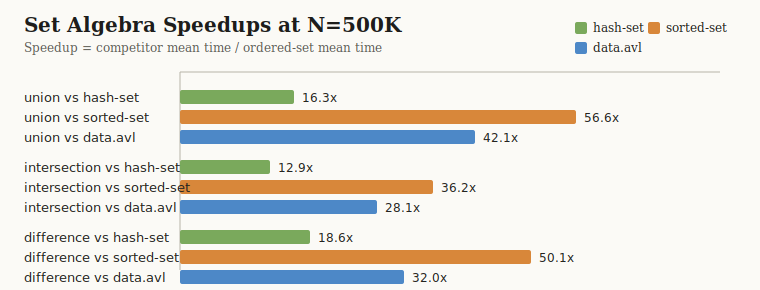
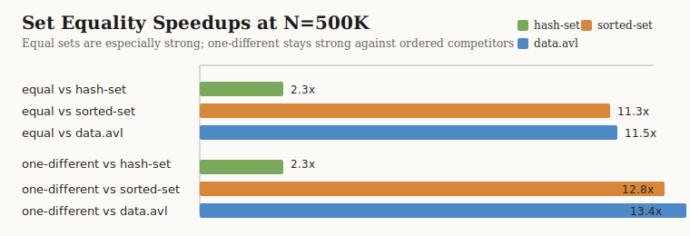
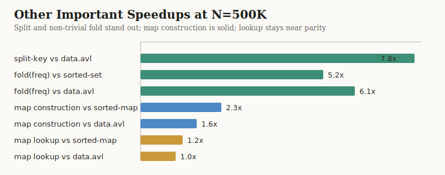

# Benchmark Report: 2026-04-04

This report summarizes the last full benchmark run recorded in
[`bench-results/2026-04-04_19-33-18.edn`](../../bench-results/2026-04-04_19-33-18.edn).
It is intended as a technical, user-facing performance snapshot: readable at a
glance, but grounded in the actual benchmark artifact and benchmark code.

## Executive Summary

- `ordered-set` is the clear winner on set algebra.
  At `N=500K`, it is:
  - `16.3x` faster than `clojure.set` on hash-sets for `union`
  - `56.6x` faster than `clojure.set` on `sorted-set` for `union`
  - `42.1x` faster than `clojure.set` on `data.avl` sets for `union`
- The same pattern holds for `intersection` and `difference`, with large and
  widening wins as cardinality grows.
- Equality on large ordered sets is also strong.
  For equal `500K` sets, `ordered-set` is about `11.3x` faster than
  `sorted-set` and `11.5x` faster than `data.avl`.
- `split-key` remains a standout structural operation.
  At `N=500K`, `ordered-set` is `7.8x` faster than `data.avl`.
- `ordered-map` construction is materially faster than both `sorted-map` and
  `data.avl`.
- Lookup is not the headline result. It remains in the same practical tier as
  the alternatives, with small constant-factor wins in some cases and near
  parity in others.
- Parallel `fold` on non-trivial work is a real advantage once the collections
  are large enough.

## Benchmark Environment

The run recorded in
[`bench-results/2026-04-04_19-33-18.edn`](../../bench-results/2026-04-04_19-33-18.edn)
captured the following environment metadata:

- Machine: 2023 MacBook M2-class host (`aarch64`, `12` processors)
- OS: `Mac OS X 26.3.1`
- Java: `25.0.2`, Homebrew OpenJDK
- Clojure: `1.12.4`
- Leiningen: `2.12.0`
- Heap max: `8192 MB`
- Project version: `0.2.0-SNAPSHOT`
- Git rev: `6ae8c53c757489ed7cae19fe290a380833a8bfde`
- Git dirty: `false`

The full artifact also records:

- raw benchmark sizes
- JVM input args
- heap and non-heap memory usage
- hostname and timezone
- per-benchmark confidence intervals, quartiles, sample counts, execution
  counts, and outlier summaries

That artifact should be treated as the record of record for the results here.

## Benchmark Contract

These numbers come from the full benchmark runner:

- runner: [`test/ordered_collections/bench_runner.clj`](../../test/ordered_collections/bench_runner.clj)
- shared workloads: [`test/ordered_collections/bench_utils.clj`](../../test/ordered_collections/bench_utils.clj)

Important workload definitions:

- Set algebra (`union`, `intersection`, `difference`)
  uses overlapping randomized integer sets built by
  `overlapping-set-variants`.
- Equality uses randomized integer sets in distinct scenarios:
  - equal sets
  - same cardinality, one different element
  - size-different by one
- Fold uses a non-trivial frequency-map workload from
  `fold-frequency-workload`, not just scalar `+`.
- Split uses the actual public split API:
  - `avl/split-key`
  - `ordered-collections.core/split-key`
- Rank uses the actual public rank API:
  - `avl/rank-of`
  - `ordered-collections.core/rank`

This matters because the report is about practical user-facing performance, not
just internal microbenchmarks.

## Visual Summary

### Set Algebra at `N=500K`



At `500K`, `ordered-set` is decisively faster than all compared alternatives.
The biggest result in this run is `union` vs `sorted-set` at `56.6x`.

### Set Equality at `N=500K`



The equal-set case is consistently strong. The same-size one-different case is
also strong against `sorted-set` and `data.avl`. Against plain hash-set, the
story is more workload-sensitive and should be read as a caveat rather than a
headline claim.

### Other Operations at `N=500K`



This run also shows strong wins in `split-key`, non-trivial parallel `fold`,
and map construction. Map lookup remains a same-tier result rather than a
flagship differentiator.

## Headline Tables

### Set Algebra Speedups

Speedup means `competitor_time / ordered_set_time`.

| Operation | N=10K | N=100K | N=500K |
| --- | ---: | ---: | ---: |
| `union` vs `clojure.set/hash-set` | `4.2x` | `7.2x` | `16.3x` |
| `union` vs `sorted-set` | `15.4x` | `26.4x` | `56.6x` |
| `union` vs `data.avl` | `10.9x` | `20.6x` | `42.1x` |
| `intersection` vs `clojure.set/hash-set` | `3.8x` | `6.1x` | `12.9x` |
| `intersection` vs `sorted-set` | `9.0x` | `17.0x` | `36.2x` |
| `intersection` vs `data.avl` | `7.2x` | `13.0x` | `28.1x` |
| `difference` vs `clojure.set/hash-set` | `4.4x` | `7.6x` | `18.6x` |
| `difference` vs `sorted-set` | `9.6x` | `22.1x` | `50.1x` |
| `difference` vs `data.avl` | `7.2x` | `12.7x` | `32.0x` |

### Set Equality Speedups

Equal sets:

| N | vs `hash-set` | vs `sorted-set` | vs `data.avl` |
| --- | ---: | ---: | ---: |
| `10K` | `2.8x` | `12.0x` | `14.1x` |
| `100K` | `2.3x` | `9.3x` | `9.5x` |
| `500K` | `2.3x` | `11.3x` | `11.5x` |

Same cardinality, one different element:

| N | vs `hash-set` | vs `sorted-set` | vs `data.avl` |
| --- | ---: | ---: | ---: |
| `10K` | `1.0x` | `12.5x` | `14.1x` |
| `100K` | `0.3x` | `13.7x` | `13.9x` |
| `500K` | `2.3x` | `12.8x` | `13.4x` |

Interpretation:

- `ordered-set` is excellent on large structural equality checks.
- `hash-set` can still be better on some unequal cases, especially when its
  hashing behavior lets it short-circuit cheaply.
- `sorted-set` and `data.avl` remain well behind in both equal and near-miss
  equality workloads.

### Other Important Results

#### Map Construction

| N | vs `sorted-map` | vs `data.avl` |
| --- | ---: | ---: |
| `10K` | `2.1x` | `1.6x` |
| `100K` | `1.9x` | `1.3x` |
| `500K` | `2.3x` | `1.6x` |

#### `split-key`

| N | vs `data.avl` |
| --- | ---: |
| `10K` | `6.8x` |
| `100K` | `7.2x` |
| `500K` | `7.8x` |

#### Parallel `fold` on Frequency-Map Work

This workload is intentionally non-trivial. It groups values into buckets and
merges partial frequency maps, which gives the fold machinery real combine work.

| N | vs `sorted-set` fold | vs `data.avl` fold |
| --- | ---: | ---: |
| `10K` | `3.1x` | `3.8x` |
| `100K` | `4.9x` | `5.4x` |
| `500K` | `5.2x` | `6.1x` |

`ordered-set` also clearly beats its own sequential reduce path on this
workload:

| N | ordered-set reduce | ordered-set fold | fold speedup |
| --- | ---: | ---: | ---: |
| `10K` | `774,610 ns` | `295,488 ns` | `2.6x` |
| `100K` | `8,384,624 ns` | `1,886,914 ns` | `4.4x` |
| `500K` | `44,681,818 ns` | `10,251,857 ns` | `4.4x` |

#### Map Lookup

| N | vs `sorted-map` | vs `data.avl` |
| --- | ---: | ---: |
| `10K` | `1.3x` | `1.3x` |
| `100K` | `1.1x` | `1.1x` |
| `500K` | `1.2x` | `1.0x` |

This is the right way to describe lookup: same practical tier, sometimes a bit
better, but not the reason to choose the library.

## Raw Mean Times for Selected Claims

### Set Algebra at `N=500K`

| Operation | `hash-set` / `clojure.set` | `sorted-set` / `clojure.set` | `data.avl` / `clojure.set` | `ordered-set` |
| --- | ---: | ---: | ---: | ---: |
| `union` | `70,932,068 ns` | `246,603,033 ns` | `183,403,395 ns` | `4,357,094 ns` |
| `intersection` | `60,697,901 ns` | `170,022,270 ns` | `131,959,561 ns` | `4,696,155 ns` |
| `difference` | `58,122,595 ns` | `156,967,609 ns` | `100,239,651 ns` | `3,131,228 ns` |

### Set Equality at `N=500K`

Equal sets:

| Implementation | Mean |
| --- | ---: |
| `hash-set` | `18,862,666 ns` |
| `sorted-set` | `93,638,488 ns` |
| `data.avl` | `95,298,029 ns` |
| `ordered-set` | `8,319,815 ns` |

Same-size, one-different:

| Implementation | Mean |
| --- | ---: |
| `hash-set` | `16,444,597 ns` |
| `sorted-set` | `90,709,109 ns` |
| `data.avl` | `94,828,113 ns` |
| `ordered-set` | `7,090,395 ns` |

## Technical Basis for the Performance Claims

These results are not attributed to a single trick.

### 1. Split/Join Tree Algebra

The library’s ordered collections are built around weight-balanced trees with
first-class split/join operations. That matters because many high-value
operations are naturally phrased in terms of:

- split at key or rank
- recurse independently on subproblems
- join the answers back together

This directly benefits:

- `union`
- `intersection`
- `difference`
- `split-key`
- rank and slice operations

### 2. Efficient Ordered Equality

Equality on ordered sets benefits from tree-aware traversal and comparison over
already-ordered structure. That is why the equal-set results are so strong even
against plain hash-set baselines.

The one-different case is more nuanced:

- ordered structural comparison is still very good against `sorted-set` and
  `data.avl`
- hash-set can win on some near-miss cases, especially when the mismatch is
  cheap to discover via hashing

### 3. Tree-Aware `CollFold`

`ordered-set` and related collections implement `CollFold` using tree-aligned
chunking and subtree-based reduction. The benchmark here uses a frequency-map
workload specifically because scalar `+` would understate the advantage of the
combining phase.

### 4. Construction Paths

Batch construction is stronger than the built-in sorted collections and
`data.avl` in this run. That advantage is visible already at `10K` and remains
meaningful at `500K`.

## Caveats

This report is intentionally favorable where the data is favorable, but it is
not meant to overclaim.

- Lookup is not a headline advantage.
- Hash-set remains competitive or better in some unequal equality cases.
- These numbers are from one clean machine and one full run; the artifact
  records confidence intervals and outlier summaries, and those should be
  consulted for deeper analysis.
- The primary benchmark of record is the full Criterium run in
  [`bench-results/2026-04-04_19-33-18.edn`](../../bench-results/2026-04-04_19-33-18.edn),
  not the quick `bench-simple` output.

## Reproduction

From the project root:

```bash
lein bench --full
```

For quick, non-authoritative iteration:

```bash
lein bench-simple --full
```

The benchmark implementation and workload definitions live in:

- [`test/ordered_collections/bench_runner.clj`](../../test/ordered_collections/bench_runner.clj)
- [`test/ordered_collections/bench_utils.clj`](../../test/ordered_collections/bench_utils.clj)

For broader context, see:

- [`doc/benchmarks.md`](../benchmarks.md)
- [`README.md`](../../README.md)
