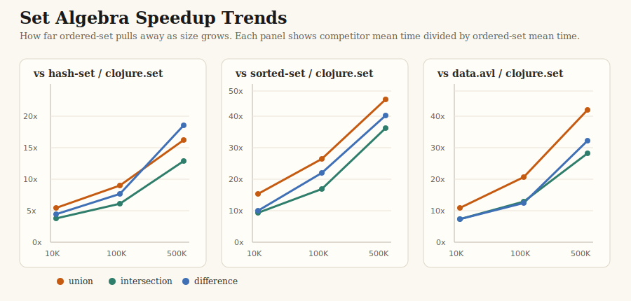
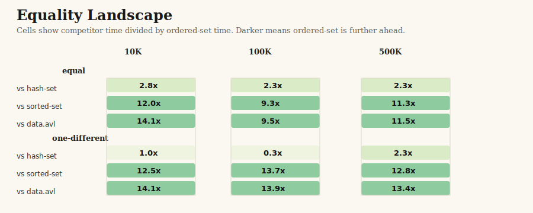
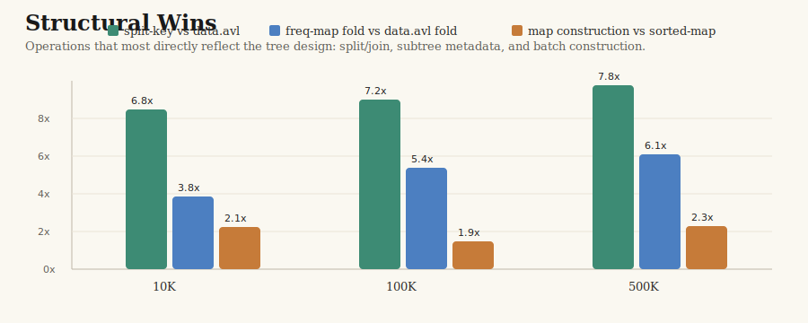
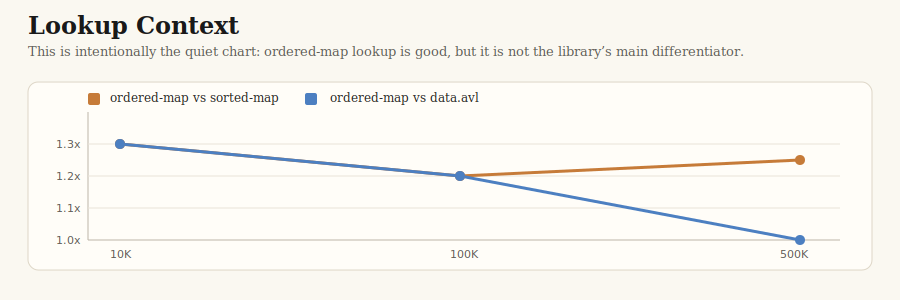
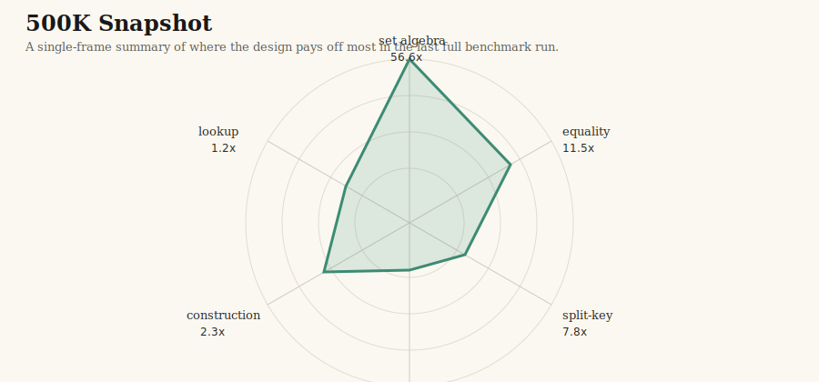

# Benchmark Report: 2026-04-04

This report is a visual summary of the full benchmark artifact:
[`bench-results/2026-04-04_19-33-18.edn`](../../bench-results/2026-04-04_19-33-18.edn).

The goal here is not to restate every table from
[`doc/benchmarks.md`](../benchmarks.md). It is to make the wins visible.

## What Stands Out

- `ordered-set` dominates set algebra as cardinality grows.
- `ordered-set` is also excellent at structural equality on large ordered sets.
- `split-key` is a major structural advantage over `data.avl`.
- `ordered-map` construction is materially faster than both `sorted-map` and `data.avl`.
- Parallel `fold` on real combine work is a substantial win.
- Lookup remains near-parity. It is included for context, not as a headline claim.

## Visual Summary

### 1. Set Algebra Growth Curve

This is the main story of the library. The gap is already large at `10K`, then
widening sharply by `100K` and `500K`. The standout point in this run is
`union` vs `sorted-set` at `56.6x`.

### 2. Equality Landscape

Large ordered equality is another strong result. Equal-set comparisons are
consistently fast, and one-different comparisons remain far ahead of
`sorted-set` and `data.avl`. The `hash-set` comparison is more nuanced, which
is exactly why the chart includes it.

### 3. Structural Operations

This chart highlights the operations most directly tied to the tree design:

- `split-key`
- map construction
- non-trivial `fold`

These are not isolated microbenchmarks. They reflect the structural advantages
of split/join operations, subtree metadata, and tree-aware `CollFold`.

### 4. Lookup Context

Lookup is in the same practical tier as the alternatives. That is the honest
interpretation. The point of this chart is to show that the benchmark story is
not being overstated: the library wins where its design should win, not
everywhere indiscriminately.

### 5. 500K Snapshot

At `500K`, the profile is very clear:

- set algebra is overwhelmingly strong
- split and fold are strong
- construction is solid
- lookup is modest

## Claims Backed by the Charts

### Set Algebra Speedups

Speedup means `competitor mean time / ordered-set mean time`.

| Operation | N=10K | N=100K | N=500K |
| --- | ---: | ---: | ---: |
| `union` vs `hash-set` | `4.2x` | `7.2x` | `16.3x` |
| `union` vs `sorted-set` | `15.4x` | `26.4x` | `56.6x` |
| `union` vs `data.avl` | `10.9x` | `20.6x` | `42.1x` |
| `intersection` vs `hash-set` | `3.8x` | `6.1x` | `12.9x` |
| `intersection` vs `sorted-set` | `9.0x` | `17.0x` | `36.2x` |
| `intersection` vs `data.avl` | `7.2x` | `13.0x` | `28.1x` |
| `difference` vs `hash-set` | `4.4x` | `7.6x` | `18.6x` |
| `difference` vs `sorted-set` | `9.6x` | `22.1x` | `50.1x` |
| `difference` vs `data.avl` | `7.2x` | `12.7x` | `32.0x` |

### Equality Speedups

Equal sets:

| N | vs `hash-set` | vs `sorted-set` | vs `data.avl` |
| --- | ---: | ---: | ---: |
| `10K` | `2.8x` | `12.0x` | `14.1x` |
| `100K` | `2.3x` | `9.3x` | `9.5x` |
| `500K` | `2.3x` | `11.3x` | `11.5x` |

Same-size, one-different:

| N | vs `hash-set` | vs `sorted-set` | vs `data.avl` |
| --- | ---: | ---: | ---: |
| `10K` | `1.0x` | `12.5x` | `14.1x` |
| `100K` | `0.3x` | `13.7x` | `13.9x` |
| `500K` | `2.3x` | `12.8x` | `13.4x` |

### Other Key Results

| Benchmark | N=10K | N=100K | N=500K |
| --- | ---: | ---: | ---: |
| `split-key` vs `data.avl` | `6.8x` | `7.2x` | `7.8x` |
| map construction vs `sorted-map` | `2.1x` | `1.9x` | `2.3x` |
| map construction vs `data.avl` | `1.6x` | `1.3x` | `1.6x` |
| freq-map `fold` vs `sorted-set` fold | `3.1x` | `4.9x` | `5.2x` |
| freq-map `fold` vs `data.avl` fold | `3.8x` | `5.4x` | `6.1x` |

`ordered-set` also beats its own sequential reduce path on the frequency-map
fold workload:

| N | ordered-set reduce | ordered-set fold | speedup |
| --- | ---: | ---: | ---: |
| `10K` | `774,610 ns` | `295,488 ns` | `2.6x` |
| `100K` | `8,384,624 ns` | `1,886,914 ns` | `4.4x` |
| `500K` | `44,681,818 ns` | `10,251,857 ns` | `4.4x` |

Lookup:

| N | vs `sorted-map` | vs `data.avl` |
| --- | ---: | ---: |
| `10K` | `1.3x` | `1.3x` |
| `100K` | `1.1x` | `1.1x` |
| `500K` | `1.2x` | `1.0x` |

## Technical Basis

These measurements line up with the design of the library.

### Split/Join Tree Algebra

The core ordered collections are built around weight-balanced trees with
first-class split/join operations. That directly benefits:

- `union`
- `intersection`
- `difference`
- `split-key`
- rank and slice operations

### Ordered Structural Comparison

Large equality checks benefit from comparing already-ordered structure rather
than treating the collection as an unordered bag of hashes.

### Tree-Aware `CollFold`

The `fold` results here use a non-trivial frequency-map workload rather than
plain `+`. That is deliberate: it measures real combine work, not just scalar
addition.

### Construction Quality

The construction results show that the library is not just good at specialized
operations. It also has a strong general build path for large ordered maps and
sets.

## Benchmark Contract

The benchmark implementation lives in:

- [`test/ordered_collections/bench_runner.clj`](../../test/ordered_collections/bench_runner.clj)
- [`test/ordered_collections/bench_utils.clj`](../../test/ordered_collections/bench_utils.clj)

Important workload notes:

- set algebra uses overlapping randomized integer sets
- equality uses equal and near-miss workloads
- split uses the actual public split API
- rank uses the actual public rank API
- fold uses a frequency-map reducer/combiner, not just scalar addition

The environment captured in the artifact includes:

- Java `25.0.2`
- Clojure `1.12.4`
- `12` processors
- `8 GB` max heap
- clean git state

## Caveats

- Lookup is near-parity, not a major differentiator.
- `hash-set` remains competitive on some unequal equality workloads.
- This report is derived from one full clean run; the EDN artifact contains the
  confidence intervals, quartiles, sample counts, and outlier summaries.

For the full raw benchmark record, see:

- [`bench-results/2026-04-04_19-33-18.edn`](../../bench-results/2026-04-04_19-33-18.edn)
- [`doc/benchmarks.md`](../benchmarks.md)
