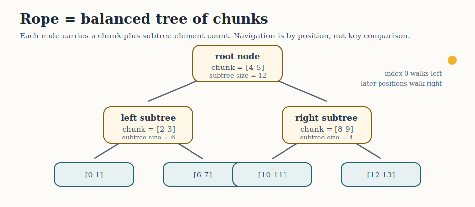
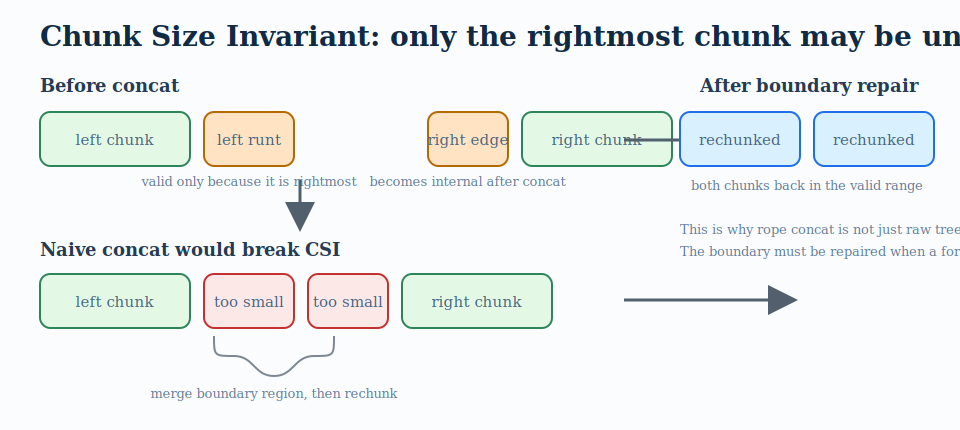
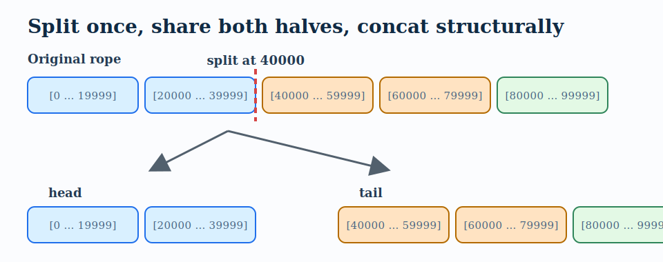
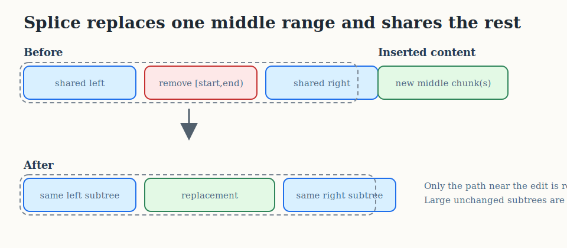

# Ropes

## Status

The rope is a **public** collection type in `ordered-collections.core`.

```clojure
(require '[ordered-collections.core :as oc])

(oc/rope [1 2 3 4 5])
```

Implementation namespaces:

- `ordered-collections.types.rope` — `Rope` deftype
- `ordered-collections.kernel.rope` — low-level chunked tree operations


## What a Rope Is

A rope is a persistent sequence representation designed to make large
concatenations, slices, and edits cheaper than repeatedly copying flat arrays
or strings.

The classic rope idea is:

- store content in **chunks**
- organize those chunks in a **tree**
- keep enough subtree metadata to support indexing and slicing efficiently
- share unchanged structure across derived values

This is a particularly natural fit when the underlying architecture already has:

- persistent balanced trees
- efficient structural sharing
- good split/join mechanics

That is exactly why ropes are interesting in this codebase.


## Why a Rope Here

This library is built around persistent, weight-balanced trees. That makes
ropes much more natural than array-backed vectors.

For a rope, the tree gives you:

- persistent concatenation
- persistent split
- subrange extraction with structure sharing
- stable asymptotic indexed navigation via subtree sizes

For ordinary vector workloads, Clojure's built-in `PersistentVector` remains the
reference implementation. The rope experiment is interesting because it may do
some **different** things well:

- repeated concatenation
- repeated splitting
- splicing persistent sequences
- editing large sequences without flattening them eagerly


## Rope vs Vector

These are not the same data structure, even if both support `nth` and `assoc`.

`PersistentVector` is optimized for:

- ordinary random access
- append-heavy use
- general-purpose vector workloads

A rope is optimized for:

- concatenation as a first-class operation
- splitting and slicing
- structural editing
- sharing large unchanged pieces

So the right question is not:

- "Can a rope beat `PersistentVector` everywhere?"

The better question is:

- "Can a rope offer a compelling structural-editing sequence type?"

### Benchmark Summary

| Workload | N=10K | N=100K | N=500K |
|---|---:|---:|---:|
| 200 random edits | **43x** | **498x** | **1968x** |
| Single splice | **6x** | **116x** | **584x** |
| Concat many pieces | **3.4x** | **5.4x** | **9.5x** |
| Chunk iteration | **58x** | **83x** | **117x** |
| Fold (sum) | **5.6x** | **1.5x** | **1.3x** |
| Reduce (sum) | 0.4x | **1.7x** | **1.3x** |
| Random nth (1000) | 0.7x | 0.5x | 0.4x |

The rope wins on 6 of 7 workloads at scale. The advantage grows with collection
size because structural editing is O(log n) vs O(n). Parallel fold beats vectors
via tree-based fork-join decomposition. Random nth is slower (O(log n) vs O(1))
— an inherent tradeoff of tree-backed indexing.


## Rope Design in This Library

The experimental implementation is a **chunked implicit-index rope tree**.

Conceptually:

- each node stores a chunk vector
- node value stores total subtree element count
- left/right children are rope subtrees
- balancing uses the same weight-balanced tree ideas used elsewhere in the
  library
- element positions are derived from subtree sizes, not from user-visible keys

This means:

- there is no comparator
- there is no ordered-key API
- position is the ordering

That is an important design point. The rope is **not** an `ordered-map` from
integer index to value. It is its own collection type with its own low-level
tree layer.



The key visual idea is that indexing is a two-stage operation:

- walk the tree by subtree sizes
- then index within one chunk

That is why the rope can support `nth`, `assoc`, split, and slicing without
pretending that element positions are stored as explicit keys.


## Chunked Leaves

The current rope implementation is chunked rather than storing one element per
node.

That improves locality and makes the data structure more honestly rope-like.

At a high level:

- small edits often affect only one chunk and a logarithmic path of tree nodes
- splits and concatenations work by rearranging chunk-bearing tree nodes
- indexing descends by subtree element counts, then indexes within the chunk



The subtle rule is the **Chunk Size Invariant (CSI)**:

- every internal chunk must be in the valid size range
- only the rightmost chunk, called the **runt**, is allowed to be undersized

That right-edge exception keeps append efficient, but it also means structural
operations must sometimes repair chunk boundaries. In particular, concat, split,
slice, and splice can move a former right-edge runt into the interior, where it
must be merged and rechunked back into a valid shape.


## API

From `ordered-collections.core`:

- `rope`
- `rope-concat`
- `rope-split`
- `rope-sub`
- `rope-insert`
- `rope-remove`
- `rope-splice`
- `rope-chunks`
- `rope-chunk-count`
- `rope-str`
- `rope-concat-all`
- `rope-chunks-reverse`

And the `Rope` type itself supports:

- `count`, `nth`, `get`, `assoc`, `conj`, `peek`, `pop`
- vector-style function lookup
- `seq`, `rseq`
- `reduce` (with correct early termination via `reduced`)
- `clojure.core.reducers/fold` (parallel fork-join)
- `compare` (lexicographic)
- `java.util.List`: `get`, `indexOf`, `lastIndexOf`, `contains`, `subList`
- `java.util.Collection`: `size`, `isEmpty`, `toArray`, `containsAll`
- metadata, sequential equality, ordered hashing


## Examples

```clojure
(require '[ordered-collections.core :as oc])
```

### Construction

```clojure
(def r (oc/rope [0 1 2 3 4 5]))

(count r)
;; => 6

(nth r 3)
;; => 3

(vec r)
;; => [0 1 2 3 4 5]
```

### Concatenation

```clojure
(def a (oc/rope [0 1 2]))
(def b (oc/rope [3 4 5]))

(vec (oc/rope-concat a b))
;; => [0 1 2 3 4 5]
```

### Split and Slice

```clojure
(let [[l r] (oc/rope-split (oc/rope (range 10)) 4)]
  [(vec l) (vec r)])
;; => [[0 1 2 3] [4 5 6 7 8 9]]

(vec (oc/rope-sub (oc/rope (range 10)) 3 7))
;; => [3 4 5 6]
```

### Insertion

```clojure
(vec (oc/rope-insert (oc/rope (range 6)) 2 [:a :b]))
;; => [0 1 :a :b 2 3 4 5]
```

### Range Removal

```clojure
(vec (oc/rope-remove (oc/rope (range 10)) 4 7))
;; => [0 1 2 3 7 8 9]
```

### Splicing

```clojure
(vec (oc/rope-splice (oc/rope (range 10)) 2 5 [:x :y]))
;; => [0 1 :x :y 5 6 7 8 9]
```

### Chunk Introspection

```clojure
(def r (oc/rope (range 130)))

(oc/rope-chunk-count r)
;; => 3

(mapv count (oc/rope-chunks r))
;; => [64 64 2]
```

This chunk view is useful because it exposes the real structure of the rope.
Unlike a flat vector, a rope has meaningful chunk boundaries.


## Tutorial: When and How to Use a Rope

Most people encounter ropes in the context of text editors. That is a valid use
case, but it is a narrow lens. A rope is a general-purpose persistent sequence
type that excels at **structural editing** — any workload where you repeatedly
split, concatenate, splice, or slice large sequences without wanting to copy the
whole thing every time.

This tutorial walks through several concrete scenarios where a rope is a better
fit than a vector.


### Setup

```clojure
(require '[ordered-collections.core :as oc])
```


### Scenario 1: Assembling a Large Sequence from Parts

Suppose you are collecting data from many sources and need to merge the results
into one ordered sequence. With vectors, each concatenation copies both sides:

```clojure
;; Expensive with vectors — every `into` copies everything accumulated so far
(reduce into [] [chunk-a chunk-b chunk-c chunk-d ...])
```

With a rope, concatenation is structural. No bulk copying happens — the rope
just records that the pieces sit next to each other in a tree:

```clojure
(def parts [(oc/rope sensor-readings-batch-1)
            (oc/rope sensor-readings-batch-2)
            (oc/rope sensor-readings-batch-3)])

(def combined (reduce oc/rope-concat (oc/rope) parts))

;; The full sequence is available for indexed access or reduce,
;; but no flattening happened:
(count combined)
(nth combined 12345)
(reduce + combined)
```

This matters when the parts are large and numerous. The rope grows by adding
tree structure, not by copying elements.


### Scenario 2: Splitting and Rearranging

A common pattern in data pipelines: take a large sequence, split it at a
position, and rearrange or process the halves independently.

```clojure
(def events (oc/rope (range 100000)))

;; Split at position 40000
(let [[head tail] (oc/rope-split events 40000)]
  ;; head and tail share structure with the original
  (count head)  ;; => 40000
  (count tail)  ;; => 60000

  ;; Process tail, then put it back in front of head
  (def reordered (oc/rope-concat tail head)))
```

Both `rope-split` and `rope-concat` are O(log n). The original `events` rope
is unchanged — this is persistent. You now have three independent snapshots of
the sequence (original, head, tail) without tripling memory usage.



The important point is that split does not flatten the rope into two vectors.
It cuts one path through the tree, reuses the untouched subtrees on each side,
and then restores chunk validity at the new fringes.


### Scenario 3: Splicing Into the Middle

Inserting elements into the middle of a vector is O(n) — every element after the
insertion point must be shifted. With a rope, it is O(log n):

```clojure
(def timeline (oc/rope (range 1000)))

;; Insert a burst of priority events at position 200
(def updated (oc/rope-insert timeline 200 [:alert-1 :alert-2 :alert-3]))

(nth updated 200)  ;; => :alert-1
(nth updated 203)  ;; => 200  (original element, shifted right)
```

This is useful for any ordered stream where you need to retroactively inject
data at a specific position.

Remove a range just as easily:

```clojure
;; Remove positions 400 through 500
(def trimmed (oc/rope-remove timeline 400 500))

(count trimmed)  ;; => 900
```

Or replace a range:

```clojure
;; Replace positions 100–110 with new data
(def patched (oc/rope-splice timeline 100 110 [:patched]))

(count patched)  ;; => 991  (removed 10, inserted 1)
```



That picture is the essence of why ropes are attractive for persistent editing:
the edit rebuilds the path near the change, but large left and right regions
remain shared with the previous version.


### Scenario 4: Windowing and Slicing

Extract a subrange without copying the entire sequence:

```clojure
(def measurements (oc/rope (range 1000000)))

;; Extract a window — this shares structure with the original
(def window (oc/rope-sub measurements 499000 501000))

(count window)  ;; => 2000
(nth window 0)  ;; => 499000
```

The resulting rope shares structure with the original and supports all rope
operations including `assoc`, `conj`, `peek`, `pop`, and further slicing.


### Scenario 5: Version History / Undo

Because ropes are persistent, every edit produces a new rope that shares
structure with the previous version. This makes version history cheap:

```clojure
(def v0 (oc/rope [:a :b :c :d :e]))
(def v1 (oc/rope-insert v0 2 [:x :y]))
(def v2 (oc/rope-remove v1 0 2))
(def v3 (oc/rope-splice v2 1 3 [:z]))

;; All four versions coexist, sharing most of their structure:
(into [] v0)  ;; => [:a :b :c :d :e]
(into [] v1)  ;; => [:a :b :x :y :c :d :e]
(into [] v2)  ;; => [:x :y :c :d :e]
(into [] v3)  ;; => [:x :z :d :e]
```

The memory cost of keeping all four versions is much less than four independent
copies. This pattern applies to any application that needs to track or undo
edits to an ordered collection: document editing, configuration changes,
simulation state, game replay.


### Scenario 6: Parallel Reduction

Ropes support `clojure.core.reducers/fold` for parallel reduction via
fork-join:

```clojure
(require '[clojure.core.reducers :as r])

(def large (oc/rope (range 1000000)))

;; Sequential reduce
(reduce + large)

;; Parallel fold — splits the rope at its natural tree structure
(r/fold + large)
```

The rope's internal tree structure provides natural split points for parallel
work distribution. This is useful for compute-heavy aggregation over large
sequences.


### Scenario 7: Chunk-Aware Processing

Unlike a flat vector, a rope has visible internal structure. You can iterate
over the chunks directly, which is useful when the data was assembled from
meaningful pieces:

```clojure
(def assembled (reduce oc/rope-concat
                 (map oc/rope [[1 2 3] [4 5 6] [7 8 9]])))

;; Iterate over the internal chunks
(doseq [chunk (oc/rope-chunks assembled)]
  (println "chunk:" chunk "sum:" (reduce + chunk)))
;; chunk: [1 2 3 4 5 6 7 8 9] sum: 45
```

Note that the rope may merge small chunks for efficiency. The chunk boundaries
reflect the rope's internal balancing, not necessarily the original assembly
boundaries. But for large pieces, the original structure is typically preserved.


### Scenario 8: Converting Between Ropes, Strings, and Vectors

Ropes interoperate naturally with other Clojure and Java sequence types.

**Building ropes from anything seqable:**

```clojure
(oc/rope [1 2 3])           ;; from a vector
(oc/rope (range 1000))      ;; from a range
(oc/rope '(:a :b :c))       ;; from a list
(oc/rope "hello")           ;; from a string (rope of Characters)
```

**Rope to String** — `rope-str` uses a chunk-aware StringBuilder, much faster
than `(apply str r)` for large ropes:

```clojure
(def doc (oc/rope "The quick brown fox"))

(oc/rope-str doc)
;; => "The quick brown fox"

;; After editing:
(oc/rope-str (oc/rope-splice doc 4 9 "slow"))
;; => "The slow brown fox"
```

**Rope to PersistentVector** — use `vec`:

```clojure
(type (vec (oc/rope [1 2 3])))
;; => clojure.lang.PersistentVector
```

Note that `(vector? (oc/rope [1 2 3]))` returns `false` — ropes are sequential
but not vectors.

**Rope operations accept non-rope collections** — concat, insert, and splice
coerce their arguments automatically:

```clojure
(oc/rope-concat (oc/rope [1 2]) [3 4])
;; => #ordered/rope [1 2 3 4]

(oc/rope-insert (oc/rope [1 2 3]) 1 [:a :b])
;; => #ordered/rope [1 :a :b 2 3]
```

**Interop summary:**

| From | To | How |
|---|---|---|
| Any seqable | Rope | `(oc/rope coll)` |
| String | Rope of chars | `(oc/rope "hello")` |
| Rope | String | `(oc/rope-str r)` |
| Rope | PersistentVector | `(vec r)` |
| Rope | lazy seq | `(seq r)` |
| Rope | Java array | `(.toArray r)` |
| Rope | EDN round-trip | `#ordered/rope` tagged literal |


### Scenario 9: Java Interop

The rope implements `java.util.List` and `java.util.Collection`, so it works
with Java APIs that expect these interfaces:

```clojure
(def r (oc/rope [10 20 30 40 50]))

(.get r 2)           ;; => 30
(.size r)            ;; => 5
(.contains r 30)     ;; => true
(.indexOf r 40)      ;; => 3
(.subList r 1 4)     ;; => #ordered/rope [20 30 40]
(.toArray r)         ;; => Object[5] {10, 20, 30, 40, 50}
```


### When to Use a Rope vs. a Vector

Use a **vector** when:

- you mostly append to the end and read by index
- random access performance matters more than edit performance
- the sequence is small or medium-sized
- you never split, splice, or concatenate in the middle

Use a **rope** when:

- you frequently concatenate large sequences
- you frequently split or slice sequences
- you need to splice into the middle of large sequences
- you want cheap persistent snapshots after structural edits
- you want to reduce over very large sequences in parallel
- you assemble a sequence from many parts and then process it


## Conceptual Tradeoffs

### Strengths

- persistent concatenation is natural
- persistent split is natural
- subrange extraction is natural
- structure sharing is central rather than incidental
- chunked representation offers better locality than one-element tree nodes

### Weaknesses

- random `nth` access is O(log n) rather than O(1) — inherent tree tradeoff
- split and slice are O(log n) vs O(1) for `subvec` — inherent
- reduce is slower than vectors at small N (< 10K elements)
- element-by-element construction via `conj` is slower than vectors; prefer
  `(oc/rope coll)` for bulk construction


## How This Relates to Other Rope Designs

The current design is closest to a general persistent sequence rope, not a
text-only rope.

Some rope libraries are specialized for text and therefore also expose:

- byte indexing
- character indexing
- line indexing
- UTF-8 chunk navigation
- incremental builders
- slice/view objects

Our current experiment is intentionally more general:

- chunks hold arbitrary Clojure values
- indexing is element-based
- the API is sequence-oriented rather than text-oriented


## Papers

### Boehm, Atkinson, and Plass (1995)

The canonical rope paper is:

- Hans-J. Boehm, Russ Atkinson, and Michael F. Plass.
  "Ropes: an Alternative to Strings."
  *Software: Practice and Experience* 25(12), 1995.

Repository-local materials:

- [Citation note](papers/boehm-atkinson-plass-1995-ropes-citation.md)
- [SRI citation/abstract page](papers/boehm-atkinson-plass-1995-ropes-sri.html)

Public citation page:

- https://www.sri.com/publication/ropes-an-alternative-to-strings/

This remains the most important reference for the basic rope idea:

- concatenate by structure
- slice without flattening everything
- share large unchanged subtrees


## Implementation References

### Adobe / SGI rope implementation overview

This is a valuable implementation note, especially for understanding classic
rope engineering tradeoffs:

- substring nodes
- function/lazy nodes
- balancing policy
- iterator caching
- reference-counting vs GC tradeoffs

Reference:

- https://stlab.adobe.com/stldoc_ropeimpl.html


## Prominent Open Source Rope Implementations

### Ropey

Rust text rope with a mature, well-known API and strong documentation:

- docs: https://docs.rs/ropey/latest/ropey/
- repo: https://github.com/cessen/ropey

Useful reference points:

- dedicated rope builder
- slicing model
- chunk APIs
- text-specific indexing support


### crop

Another Rust rope implementation, B-tree based and focused on text-editing
workloads:

- docs: https://docs.rs/crop/latest/crop/
- repo: https://github.com/nomad/crop

Useful reference points:

- `Rope` and `RopeBuilder`
- explicit editing operations
- text-oriented slice semantics


### xi rope

The rope implementation from the Xi editor ecosystem is another important
practical reference for persistent editing structures:

- repo: https://github.com/xi-editor/xi-editor/tree/master/rust/rope

This is particularly relevant as a design reference for editor-oriented
structural editing.


### Sycamore (Common Lisp)

A Common Lisp data-structure library that includes ropes alongside
weight-balanced trees:

- repo: https://github.com/ndantam/sycamore
- reference manual: https://quickref.common-lisp.net/sycamore.html

This is especially relevant for this project because it shows a rope living in
a Lisp ecosystem next to weight-balanced tree structures.


## Current Capabilities

The rope now provides:

- full Clojure collection interfaces: `Indexed`, `Associative`,
  `IPersistentStack`, `Seqable`, `Reversible`,
  `IReduceInit`, `IReduce`, `Counted`, `IHashEq`, `IMeta`, `IObj`,
  `Sequential`, `Comparable`
- `java.util.List` and `java.util.Collection` for Java interop
- `clojure.core.reducers/CollFold` for parallel fold
- chunk-level iteration in both directions
- structural editing: `rope-insert`, `rope-remove`, `rope-splice`
- correct `reduced` early-termination in all reduce paths
- `print-method` for readable REPL output

## Future Work

- Further constant-factor optimization of reduce at small N (0.6x at 10K;
  already 1.4x faster than vectors at N ≥ 100K)
